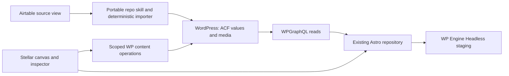

# POC-01 — Company site on the existing WordPress and Astro repositories

2026-09-13 · Selected by the user · Implementation plan; no import or deployment performed during this research.

## Outcome and confirmed boundary

Use the company site to prove that Stellar can connect to an existing project, display a real responsive Astro page, edit supported design controls and WP-owned draft content, and release a selected page through the existing WP Engine pipelines.

Seed the WordPress content from the supplied Airtable view through an independently runnable process. Astro consumes WordPress through WPGraphQL. Neither Stellar nor Convex is required to execute the import, build the site from seeded WP content, or serve the resulting site.

The user confirmed that the mapping must cover **ACF post types, fields and taxonomies**, including the corresponding content records, term assignments and relationships. This includes a versioned schema mapping, rather than only copying values into existing page fields.

The diagram shows the POC's content path. Source/schema deployments and content-publication rebuilds are separate operations and must have separate success evidence.

## Existing assets and what remains

| Asset | Confirmed identity | Readiness |
| --- | --- | --- |
| WordPress repository | [altitudemarketing/altitude-headless-theme](https://github.com/altitudemarketing/altitude-headless-theme), local [checkout](https://github.com/altitudemarketing/altitude-headless-theme/tree/80cf5252fa329523369a2a59d74bbd1c264927fa) | `wp-content` scaffold, Composer and deployment workflow exist. ACF Pro/bridge, functional content plugin, field groups, CPTs and committed SDL are absent from the inspected source. |
| Frontend repository | [altitudemarketing/altitude-astro](https://github.com/altitudemarketing/altitude-astro), local [checkout](https://github.com/altitudemarketing/altitude-astro/tree/0a9562813b49abcb20b96b704cdb70583504095a) | Astro/Node toolchain and placeholder page exist. Content queries, generated types, representative page blocks and CMS preview are not implemented. |
| WP deployment | Existing GitHub Actions pipeline | `develop` → `altitude26stg`; `main` → `altitude26`. Additive file deployment does not itself activate plugins or import content. |
| Astro deployment | Existing Headless application `altitude-astro` | Documented staging environment tracks `develop` and uses WP `altitude26stg`; production environment `main` tracks `main` and uses WP `altitude26`. Keep the current application binding. |
| Design system | Company Figma-shaped CSS-variable contract | Present values are neutral placeholders. Tailwind v4/Figma export/base components are planned, not finished. Implement representative blocks against that contract; validate Lumos separately. |
| Airtable source | [Supplied view](https://airtable.com/appctrC0fkefkHeK8/tblyECInojqSB7WF2/viw8b0xz2WntKE3Xd?blocks=hide) | Authenticated reads succeeded. Base has 16 tables/176 fields. This Grid view contains only Lead Generation (`SERV-LG`, Draft), linked to Services — Large (`serv-lg`); the other Pages record is outside the view. [Mapping report](research/airtable-acf-mapping.md) |

Readiness is based on the local source snapshot and ClickUp evidence, not a fresh check of the live WP Engine account. The two local checkouts are on different branches; reconcile the chosen implementation baseline with their remote development branches before coding. See [repository evidence](research/company-site-readiness.md) for exact commits, paths and dated deployment observations.

## Preserve the existing project decisions

- Keep the split repositories and current GitHub/Headless deployment foundations. Use WP Engine staging as the first integration environment. Read current platform configuration before modifying it; repository documents disagree about `HOST`. Do not introduce a `PORT` override or recreate the Headless application.
- Map to ACF-managed post types, field groups/fields and taxonomies, with the custom content plugin owning the integration and shared write service. Keep definitions versioned and export committed WPGraphQL SDL. The repo currently assigns Local JSON to `themes/altitude/acf-json`, while newer ClickUp design tasks prefer a content-plugin location. Preserve the configured path for the POC unless a deliberate save/load migration is included and tested; never load competing copies or register the same type twice through PHP and ACF. Generate Astro types from committed SDL without requiring live introspection during ordinary CI.
- Use hand-authored Astro components and semantic CSS variables. The company plan excludes Gutenberg, ACF Blocks and a design-token-to-`theme.json` pipeline. Client drag-and-drop in Stellar will compose approved frontend blocks independently of Gutenberg.
- Respect the August 20 owner comments: reusable-template fields are one-way **Airtable-owned**, while other page content can be WP/agent-authored. A per-post managed flag plus an explicit mapped-field set determines the boundary. Seeding does not silently release those fields for editing in Stellar.
- The import's intended interface is a **portable skill in the repository**. The task title still says WP-CLI, but its owner comment supersedes that assumption and leaves the underlying mechanism open. Put deterministic mapping, validation and idempotency in executable operations; prose instructions alone cannot guarantee correct replay.

## Implementation slices

| Slice | Work | Acceptance evidence |
| --- | --- | --- |
| 1. Representative contract | **Source inspected; target draft prepared:** Lead Generation / Services — Large, seven body sections plus global navigation/footer, declared reusable dependencies and a separate WP-owned test draft. Resolve taxonomy definitions and approve the target schema. | [Draft contract](contracts/company-airtable-acf-map.v0.1.json) has 71 source bindings checked against observed IDs. Actual ACF keys, readback fixtures and taxonomy/term mappings still need implementation; no target schema is claimed to exist. |
| 2. Minimum WordPress model | Add required plugin dependencies, content plugin, one field group and only necessary related CPT/taxonomy. Make activation/configuration repeatable. Export SDL and establish the agent/import write service. | Clean fixture exposes the expected schema; fields validate; unsupported fields fail explicitly; production credentials are unnecessary. |
| 3. Independent seed/import | Deliver the repo skill plus its executor. Run manually against the disposable fixture, then staging, before deciding scheduled triggers. | Dry run makes no writes; repeat import creates no duplicates and changes no unchanged timestamps/media; records can be read back via WPGraphQL; no Stellar/Convex runtime is involved. |
| 4. Real Astro page and preview | Build one typed content query and a few responsive blocks using company tokens. Add an authenticated draft preview keyed by WP ID, an offline test fixture, and a declared render strategy. | Correct text, media and ordering at phone/tablet/desktop sizes. Public reads exclude drafts. Preview shows the selected draft and prevents public caching. |
| 5. Thin Stellar editor | Connect the existing repos and isolated preview. Add selection, a supported block move/variant/token control, content ownership indicators, and agent/manual proposals for allowed WP-owned fields. Token edits use the designated token source/export or an explicitly supported project override layer; do not hand-edit generated `globals.css`. | Source edits survive reload/reparse; a shared token edit shows its impact and survives the next token export; one allowed draft write round-trips; attempts to edit Airtable-owned fields fail on the server. |
| 6. Selected page release | Use the existing staging deployment path; wire content-publication rebuilds for prerendered pages. Keep a second page unpublished and record code/content versions. | Seeded content renders with Airtable/Stellar unavailable; a publish event rebuilds the static page; repeated events do not create conflicting releases; a failed Astro build/Headless promotion preserves the prior frontend artifact; draft page stays out of routes/navigation. |

An SSR route can establish the first read/preview loop quickly, but it does not complete the static publishing proof. Before this POC closes, demonstrate one prerendered route refreshing through the publish/rebuild path. Updating an already-published WP record is not automatically an isolated draft revision: use an explicit draft fixture or verified proposal/revision mechanism.

The failed-frontend-build acceptance is a behavior to verify, not an atomicity guarantee for WordPress code deployment. The existing WP workflow uses live `rsync --inplace`; interruption can leave partially updated files. Record a staging recovery procedure and use additive schema changes compatible with both frontend revisions. Atomic WP code rollout or verified rollback remains separate work before a production release guarantee can be made.

## Import and ownership contract

The mapping has two stages: reconcile the desired ACF schema with the registered WordPress model, then seed records against that approved schema version. A changed Airtable column must not silently change the production CMS structure. ACF supports versioned Local JSON for field groups, post types and taxonomies; verify the installed version and save/load configuration before choosing the exact schema deployment mechanism. [ACF Local JSON](https://www.advancedcustomfields.com/resources/local-json/)

| Mapping level | Required target contract |
| --- | --- |
| Content type | Selected Airtable table/view or record discriminator → ACF post-type definition and stable WordPress `post_type` slug. A source table is not automatically a post type. |
| Record | Source record identity → WP post ID, with explicit title, slug, status and template mapping. |
| Field group/field | Source field ID → stable ACF group/field key, field type, location rules, required/default values and conversion/validation rules. |
| Taxonomy | Source classification table/field → ACF taxonomy definition, stable taxonomy slug, attached post types and hierarchy. |
| Term/assignment | Source term identity → WP term ID and parent; source memberships → post/term assignments with explicit ordering where the consumer requires it. |
| Relationship | Linked source records → ACF post-object/relationship references or taxonomy assignments, selected by meaning and cardinality rather than field type alone. |
| Media | Source attachment identity → WP attachment ID and ACF image/file/gallery value. |

Apply definition dependencies first, then create/update terms and posts with stable identities, and resolve parent/relationship/term assignments after referenced objects exist. Unresolved required links fail validation instead of publishing incomplete content. Ownership rules include managed taxonomy assignments and relationships as well as text fields. The [observed source mapping](research/airtable-acf-mapping.md) now supplies actual IDs and relationships. Taxonomy definitions/assignments remain provisional because no explicit taxonomy table or assignment model was observed.

The importer reads the chosen view, not the entire table. Resolve linked records in bounded batches; paginate and retry transient failures. Version mappings to stable ACF field keys with explicit conversions and schema versions. Upsert by a namespaced source identity containing base/table/record ID, mapped to a stable WP post ID. Slugs/titles can change without duplicating posts. A custom indexed mapping table may be appropriate; do not assume an ordinary WP meta-value query has a unique indexed external-ID guarantee.

Import attachments into WP media and preserve their source attachment identities; do not use temporary Airtable download URLs as permanent page content. Define replacement/deduplication, allowed file types, alt text and orphan cleanup. Resolve relationships and validate all required media before making the page visible. Stage updates, use guarded writes and retain recovery information; sequential ACF writes are not automatically an atomic page transaction.

Keep durable run/record outcomes, operation IDs, changed fields, counts and errors without secrets. A no-op run performs no writes. Partial failures remain visible and resumable, and overlapping import runs cannot race on the same source identity. The first run creates drafts; publication is a separate action.

Only the authorized import identity may change Airtable-managed fields. WP administrators, ordinary agents and exposed API routes receive clear ownership errors when attempting those writes. An Abilities permission check alone does not protect every alternative writer: enforce the policy in the shared content service and applicable WordPress hooks, and test each supported entry path. Infrastructure administrators with arbitrary PHP/database access remain outside this application-level guarantee; avoid granting that access to routine content agents.

The one-time POC seed does not need a scheduled trigger or source-absence reconciliation. Before enabling ongoing sync, implement the existing task's explicit unpublish/reappearance policy, complete-view and mass-change guards, partial-run protection and visible outcomes. Missing records in a partial seed must never imply an unpublish. If content should later become freely editable in WP/Stellar, define a separate explicit detach operation that stops future source writes.

## Shared write service and agent portability

Prefer narrowly scoped WordPress abilities for discoverable agent operations, backed by one plugin service that also supports the import executor. The import identity and editorial identity have different capabilities; a caller-supplied “import” flag must not grant ownership bypass. Pin the actual MCP adapter and verify its discovery/auth/execution behavior before selecting HTTP versus WP-CLI transport. Keep ACF field updates behind supported WordPress APIs, never direct WP SQL writes.

The official handbook places Abilities API support at WordPress 6.9+, and documents schemas and permission callbacks. Older ClickUp comments asserting an installed version are not runtime evidence; check the actual installation and required functions. [WordPress Abilities API](https://developer.wordpress.org/apis/abilities-api/)

The MCP adapter documents separate transport and ability permissions. Discovery exposure is an opt-in and does not grant write authority. These checks still need project-specific record/field ownership enforcement. [Official MCP adapter](https://github.com/WordPress/mcp-adapter)

Package the workflow as inputs, mapping version, capabilities, deterministic operations, review points and output manifest. Stellar or Agent Hub may invoke that same skill later; neither application's chat state becomes an import dependency. Convex can store Stellar's project state and content proposals without relaying Airtable records into WP.

## Playground and scope limits

Use Playground CLI beside Astro for a bounded test of the actual plugin set, schema and fixture. Its browser iframe alone is not the server endpoint for Astro's build process. If the pinned plugin/runtime combination does not work, continue against real WP Engine staging instead of blocking the content proof. Playground is not proof of MySQL, cache, license or deployment parity. See [Playground research](research/wordpress-playground-poc.md).

This slice does not require full-site migration, a generic schema/ERD builder, a Lumos migration, product search, Neon, Vercel, HTML authoring or production launch. Those remain explicit Stellar PRD epics and compatibility proofs. A successful external importer alone does not satisfy Stellar's canvas, manual/agent editing or release requirements.

## ClickUp evidence and task alignment

Read the descriptions and owner comments together; several titles/specifications predate later decisions. No ClickUp task or comment was changed during this review.

| Existing task | Implication for POC |
| --- | --- |
| [Website Build](https://app.clickup.com/t/86ajrkk2t) | Parent project supplied by the user. |
| [Create both repositories and configure org access](https://app.clickup.com/t/86ak38fcw) | Completed; owner comment records final repository URLs. |
| [Create the Headless Platform application and bind it to the Astro repository](https://app.clickup.com/t/86ak38epp) | Completed; August 26 comment records prior Portal verification. |
| [Create the production and staging Headless Platform environments on their tracked branches](https://app.clickup.com/t/86ak38eqy) | Completed configuration; recorded historical verification, not a new deployment test. |
| [Airtable / ACF / GraphQL sync mechanism](https://app.clickup.com/t/86ak2yy8q) | Existing import/schema workstream; reuse it rather than create a competing path. |
| [Define the Airtable schema, field mapping, and record identity model](https://app.clickup.com/t/86ak3a2am) | Actual mapping still needed; owner comment confirms view-based scope, but its embedded table is missing in connector output. Source IDs above come directly from the supplied URL. |
| [Decide sync direction, ownership, and conflict rules](https://app.clickup.com/t/86ak3a2e8) | Owner comment resolves one-way source authority and mandatory server enforcement even though task status remains to do. |
| [Build the sync as an idempotent WP-CLI command](https://app.clickup.com/t/86ak3a2et) | August 20 owner comment changes the deliverable to a portable repo skill, with executor transport undecided. |
| [Design the MCP content-authoring surface for agent-authored pages](https://app.clickup.com/t/86ak3a2n1) | Coordinate import and editorial capabilities/ownership; no implemented ability set was found. |
| [D — Design system integration](https://app.clickup.com/t/86ak38etc) | Preserve company CSS-variable/Astro contract; current placeholder values are not the final Figma export. |
| [E — Routing and data layer](https://app.clickup.com/t/86ak38etz) | Cover published reads, draft preview, per-route rendering and rebuild behavior. |

## Inputs to resolve at implementation

The representative source is now identified and inspected. Remaining inputs are taxonomy/classification definitions, approval of proposed WP/ACF schema keys and shared entities, completion of source-content/link/global-navigation gaps, licensed ACF artifact availability, final company token/component source, and current staging plugin/runtime state. No Agent Hub access is required for the independent POC; review its workflow contracts before finalizing the shared skill/handoff format.

Access is resolved: the official Airtable CLI accepted the saved credential and read the base/schema/content. The exact selected view was read through Airtable's official API because the CLI record tool lacks a view parameter. Source snapshot and draft mapping are linked in the [research report](research/airtable-acf-mapping.md). These were read-only operations; no Airtable or WP data changed.
