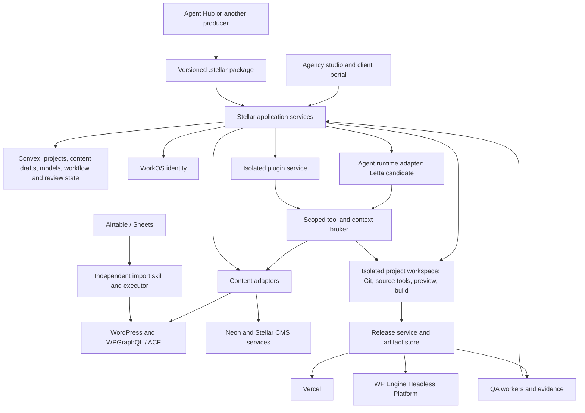

# Stellar — initial product requirements

Version 0.5 · 2026-09-14 · Draft for product and architecture review

Revision 0.5: adds a shared agency media capability, Letta-driven OpenRouter media generation, confirmed WorkOS Pipes scope, an Agent Hub reuse audit and corrected custom-loader editing requirements. A separate Stellar product using reusable foundation modules is proposed; ownership, accounts and possible in-suite packaging remain open decisions. The confirmed external Airtable → WP → WPGraphQL → Astro POC and its v0.4 mapping remain unchanged.

Stellar is an independent, agent-assisted website studio and client CMS portal. An agency uses it to turn a client brief into information architecture, responsive designs, structured content, and a deployed website. Clients maintain those sites through approved components and content controls. Developers retain ordinary source code, explicit schemas, and deployment ownership.

This document defines the product direction and epic boundaries. It does not claim that the cloned editor already implements these requirements. Platform details and proof gaps are recorded in the accompanying research. Scope and sequencing below are recommendations unless explicitly identified as user requirements.

## 1. Recommended direction

**Build Stellar as a web app, with Stacki-derived editing tools connected to isolated project workspaces.** Support the company site's existing design system in the first proof and Lumos as the first reusable third-party design-system package; make the contract support other systems and systems created from scratch. Keep Astro and actual HTML projects as separate supported project types. A desktop companion can follow if local/offline workflows justify it.

Use Next.js/React for the portal and studio, Convex for collaborative application state, content preparation and workflow coordination, and WorkOS for identity. Convex can hold logical collections, draft records, revisions and layout bindings before a target CMS exists. For WordPress/Neon-backed sites, keep applied website content in that chosen CMS and promote reviewed Stellar drafts through an explicit adapter. Evaluate Letta's current Agent SDK and Computers as the preferred agent runtime behind an adapter. Stellar owns authorization, workflow progress, release decisions, and durable project artifacts. Zep is an optional context projection, subject to a concrete retrieval need and a defined owner for each fact.

Reuse Agent Hub's working auth, Letta, skill/workflow and connection foundations selectively rather than rebuilding them. The current audit found substantial code plus unfinished scheduling, artifacts, billing, media generation and Pipes integration. The proposed default is a separately usable Stellar application with reusable modules and explicit provider/account configuration. A Websites entry in Agent Hub can open it with authorized project context. A combined platform deployment is an alternative if ownership and product boundaries align; it is not yet a confirmed direction. Stellar-only users must need no Agent Hub subscription or chat/social workspace, and standalone deployment remains a required architectural capability. A versioned `.stellar` package remains useful for portable handoffs in either arrangement. [Shared-foundation proposal](decisions/002-shared-foundation-media-and-integrations.md)

The hardest early engineering problem is reliable editing between rendered pages and source code. Prove that, genuine HTML support, remote preview isolation, and both hosting paths before committing to a broad feature schedule.

Evidence: [Stacki/Lumos evaluation](research/stacki-lumos-portability.md), [agent architecture](research/agent-runtime-and-portability.md), [CMS/deployment evaluation](research/cms-deployment-and-search.md), [plugins, toolbar, and UX](research/plugins-toolbar-and-ux.md).

## 2. Product boundaries and initial assumptions

### Required product capabilities

- Design, build, and deploy responsive **Astro and HTML** sites on a code-backed canvas.
- Let both agents and people edit designs; selected elements expose appropriate variables, tokens, component props, and content fields.
- Choose, customize, or create a design system; use reusable templates and blocks.
- Model site structure, navigation, content schemas, relationships, and data bindings through a GUI.
- Support WordPress with WPGraphQL/ACF and Neon Postgres, plus deployment to Vercel and WP Engine's appropriate hosting products.
- Run a guided website SOP, while allowing pages to advance and ship independently.
- Provide deployed feedback, authorized frontend content editing, QA, and continuing client operations.
- Extend functionality through a modular system with real isolation and scoped access.
- Make workflow definitions portable to Agent Hub and accept a Stellar project handoff format.
- Provide an agency/client/site media library with approved asset reuse, and give agents access to media generation models through a scoped OpenRouter tool.

### Confirmed choices and draft assumptions

| ID | Assumption | Why it affects the plan |
| --- | --- | --- |
| A1 | Agency team first, with invited client users; self-service sales to other agencies later. | Simplifies onboarding, support, templates, billing, and connector provisioning while preserving tenant isolation. |
| A2 | **Confirmed:** first proof uses `altitudemarketing/altitude-astro` and `altitudemarketing/altitude-headless-theme`, with Airtable seeding WP/ACF outside Stellar and Astro reading WPGraphQL. | Reuses separate WP code and Headless frontend deployment foundations. The content model, import and editor integration still need implementation; see [POC-01](POC-01-company-site.md). |
| A3 | The stages described in the request are the draft SOP until an authoritative SOP is supplied. | Stage deliverables and approval gates need agency review. |
| A4 | GitHub is the first repository provider; connect existing projects before automating every vendor account setup. | Avoids blocking editing on unrelated commercial provisioning APIs. |
| A5 | Clients compose approved sections and edit approved fields/variants; developers manage arbitrary code and global design-system changes. | Defines the client experience and permissions model. |
| A6 | Production publishing normally requires an authorized publisher; projects may later grant narrow automation rules. | Provides a clear reviewable release boundary and supports future autonomous maintenance. |

The first proof is intentionally narrower than the product. WordPress is the first target; Neon, true HTML, and both site hosts remain required work with explicit milestones and tests. Airtable supplies this POC's seed content through an independently runnable import; it is not an Astro loader or a required Stellar service. A site's build and public runtime must work with Airtable and Stellar unavailable once its content is in WP.

### Deferred from initial agency release

Offline authoring, a public plugin marketplace, arbitrary framework support, universal lossless import of any website, full Figma two-way synchronization, general ecommerce checkout, and unrestricted SQL database administration. Importing supported code is in scope; unknown constructs can remain in code view with clear limitations.

## 3. People and primary experiences

| Role | Core jobs | Default authority |
| --- | --- | --- |
| Agency owner/admin | Create workspaces, connect providers, manage access, policies, costs and templates. | Organization administration; production authority assigned explicitly. |
| Strategist/designer | Capture brief, develop IA/menu, wireframes, screen designs, content plans and review. | Project artifacts and design drafts; publishing only if granted. |
| Developer | Author blocks, code, design systems, schemas, plugins and deployment configuration. | Development changes; scoped repository and environment access. |
| Client editor | Maintain content, assets, approved landing-page compositions and SEO fields. | Draft changes to assigned sites/collections/fields. |
| Reviewer/publisher | Comment, approve deliverables, approve releases or publish within their scope. | Review-only or explicit publish grant. |
| Agent/service identity | Perform an assigned workflow step or integration action. | The intersection of project policy, requesting actor permissions, and run-specific capabilities. |

A role label is not sufficient authorization. Permissions are checked on organization, project, environment, collection, record/field where required, and action. Public visitors have no dependency on Stellar identity.

**Agency studio:** project navigation, a central canvas/list/diagram, a contextual inspector, and a collapsible agent panel. Switching among Plan, Design, Content/Data, and Review/Release changes the main workspace without losing selection or project context.

**Client portal:** a simpler entry point for Pages, Content, Media, Requests, Reports, and notifications. Approved layout controls can open a focused canvas. Repository tools, schema migrations, plugin installation, and raw tokens stay behind developer permissions.

If both products are enabled, a product/area switcher may open Agent Hub or Stellar Websites while preserving authorized client/project context. Stellar-only users enter the focused studio directly; client editors enter their assigned site portal. Permissions and product access apply at the API as well as the navigation layer.

The supplied [CMS mockup](apex-web-cms.html) supplies the strongest starting structure for Stellar. The [design-mode mockup](apex-studio-design-mode.html) informs contextual agent assistance and artifact provenance. Preserve their clear separation between navigation and work; reduce persistent setup cards and competing side panels. The canvas should receive most space during detailed design. Mobile supports review and practical content tasks; full authoring initially targets desktop browsers.

## 4. End-to-end workflow

### Project setup

The setup assistant accepts an existing repository, a blueprint/template repository, a new project, or a `.stellar` package. It collects the rendering target, design system, source/content backend, repository, site environments, and deployment destination. Validate compatibility before installing packages or provisioning resources.

Separate choices for **CMS host**, **database**, and **frontend host**. A connection to WordPress on WP Engine is not a frontend deployment destination, and Neon is a database service rather than a complete CMS. Show connected, needs access, provisioning, validating, ready, and failed states with a resumable setup checklist. Support “connect existing” where automated account creation is unavailable.

Record who owns provider accounts, repositories, domains, and charges. Reference environment credentials through managed connections. A template declares its prerequisites and produces a reviewable initialization plan.

### Context and SOP

Capture client background, audience, goals, current challenges, website scope, page types, existing URLs, brand assets, voice, source content, product-finder requirements, integrations, and success measures. Label facts, user decisions, agent suggestions, and unresolved questions separately. Attach provenance and dates; do not invent missing client facts.

| Stage | Work surface and agent support | Versioned output | Review/exit condition |
| --- | --- | --- | --- |
| Brief | Guided questions, source inventory, scope and goals. | Brief, constraints, source references, scope inventory. | Scope is sufficient to start selected work; unresolved inputs visible. |
| IA and navigation | Sitemap tree/graph, page types, route/slug controls, menu builder and rendered example menu. | IA, redirect intent, navigation variants, page-to-goal links. | Selected routes have valid hierarchy and navigation; links and labels reviewed. |
| Wireframes | Code-backed low-detail layouts for key page types; agent proposes approved blocks. | Screen/page compositions with assumptions. | Structure and key interactions approved per page/template. |
| Design and prototype | Tokens, components, responsive screens, real links, forms and interaction states. | Design revision, functional prototype and approval references. | Responsive behavior and design-system use reviewed. |
| Data and content | Collections, fields, relationships, ERD, sample records, bindings, copy and SEO. | Schema/mapping revision, migration proposal, content drafts. | Models support selected pages; validation and content ownership established. |
| Build and release | Source changes, reviewable diffs, preview, checks, release scope. | Release manifest and deployed artifact. | Required checks and authorized release decision recorded. |
| Operate | QA, client feedback, content workflows, reports, health and work queue. | Findings, requests, reviewed changes and new releases. | Findings resolved or consciously accepted; continuing activity remains traceable. |

Stages are a dependency graph, not a single mandatory waterfall. Product schema work can begin before final screen approval. A page can be in content review while another is live. An approved global token or schema change can make dependent approvals stale and should show its impact.

Changes always show a human-readable result: artifact revision, content change, source diff, or migration plan. Agent chat is an explanation and control surface; it is not the sole storage location for decisions.

### Iterative publishing example

Home and Contact are approved; Products is still in draft. A release includes Home and Contact plus their required shared assets. Navigation excludes unavailable routes unless a reviewed placeholder exists. A new draft of an already-live page leaves its previous published version live until that draft is approved and selected for release.

Track page workflow status, CMS draft/published state, and deployment state separately. “Saved,” “approved,” “queued,” “building,” “deployed,” and “verified” must not collapse into one success badge. Scheduling a content item records both the intended publication time/timezone and the actual release result.

## 5. Canvas, source code, and design systems

### Code-backed canvas

The canvas organizes independent pages/screens and responsive previews. Each screen links to a route or an explicitly non-published design exploration. Persist canvas positions and viewport presets as editor metadata, not absolute positioning imposed on the website.

Use the rendered page for layout truth. Support selection, outlines, parent/child navigation, insertion, reordering, duplication, deletion, text/prop editing, and undo/redo through typed editing commands. Flex/grid/document flow determines site layout; dragging a block changes structure or supported layout properties. A code editor remains available for developer work.

An Astro adapter handles Astro source, components, slots, expressions and supported collections. An HTML adapter handles genuine `.html`, CSS and JavaScript projects, reusable fragment/block conventions, preview, and static output. Producing HTML from an Astro build does not fulfill the separate HTML authoring requirement.

Representable source must survive no-op saves and supported edits without silent semantic changes. Unsupported code remains intact and is identified before mutation. Stable artifact/block identities plus source revisions support selection, feedback, history and handoffs; transient parser IDs are insufficient.

Agents and manual controls submit changes through the same authorization and validation layer. Direct code edits by authorized developers/agents trigger reparse and validation; they do not bypass release gates. Use revision checks and serialized changes per affected resource initially. Conflicts must produce a reviewable resolution, not last-writer-wins source loss. Real-time multiplayer cursors or full CRDT editing can follow if needed.

### Selected-element inspector

For the selected element, show content bindings, component instance/variant, local props, active breakpoint/state, applicable tokens, and where values originate. Clearly distinguish inherited, token-bound, computed, and explicit override values. Offer reset-to-token and show the scope of a proposed change: instance, component, theme, or whole project.

Changing a shared token previews affected components/pages. Clients see permitted semantic controls such as section theme, approved spacing scale, button variant, or image focal point. Developers can expose additional controls and document exceptions. Agents use the same token and component rules.

### Design-system package

A package contains identity/version, token types and aliases, CSS mappings, themes, breakpoints, components/variants/slots, editable controls, accessibility rules, agent guidance, migrations, and provenance. Support project-specific overrides with explicit ownership. Creating a system from scratch begins with token primitives/semantics, typography, layout rules and a minimal block library; it is not restricted to recoloring Lumos.

Lumos is the first reusable third-party package to validate. Pin its source and compatible toolchain. Its Astro components require explicit HTML implementations or conversion work for an HTML blueprint. The company POC adapts its existing CSS-variable/hand-authored Astro component contract; replacing that system with Lumos is not a prerequisite. A design-system update opens a migration/diff with impact review instead of silently replacing customized source.

The Stellar application's own interface design system is separate from the systems used by generated client sites.

### Blueprint/template package

A blueprint combines renderer and toolchain versions, source template, design system, content schema/mapping, approved blocks, initial IA/menu, content seeds or loader mappings, workflow defaults, deployment capabilities, required extensions and asset rights. Instantiating creates a client-owned project copy with recorded upstream provenance. Subsequent upgrades are reviewed merges, not forced inheritance.

Support reusable sections/page templates with typed fields and allowed child blocks. Preserve real code and exportability. Track which template version produced a page and whether its project customization intentionally diverges.

## 6. Information architecture, data, and content

The IA editor models pages, route patterns, page types, audience/goals, hierarchy and navigation independently from database collections. A product collection may feed thousands of detail routes; it should not require thousands of manually positioned IA nodes. Menus support named locations, nested items, internal/external links, labels, visibility and mobile behavior. Render an example menu as part of IA review.

The data GUI supports collections/tables, typed fields, validation, relations, cardinality, taxonomies/enumerations, media, reusable objects/blocks, and draft/publish rules. An ERD is a view of this model; its edits produce the same schema changes as form controls. Relationship deletion policies and affected content are explicit.

### Backend capabilities and ownership

| Backend | Owns authoritative content | Stellar responsibilities and boundaries |
| --- | --- | --- |
| WordPress + WPGraphQL/ACF | WP records, fields, taxonomies, revisions and media according to installed capabilities. | Discover schema, map stable IDs, retrieve published/draft content with proper auth, implement supported writes and schema changes through scoped APIs/companion plugin. Do not write WP SQL directly or assume all WP plugins are headless-compatible. |
| Neon Postgres | Project content tables, relationships, revisions/publication metadata managed by the chosen CMS layer. | Supply the missing CMS services: authenticated API, schema/migrations, forms, permissions, draft workflow, media integration and audit. Neon alone supplies neither the editor nor publication workflow. |
| Airtable/Sheets | External authority for explicitly managed fields; WP/Neon contain the applied values after import. | Versioned mapping, stable external IDs, ownership indicators and durable asset import. Import may run outside Stellar. For this POC there is no direct Astro loader and no writeback; preserve the existing one-way Airtable ownership policy. |
| Convex content workspace | Stellar working models, draft proposals, content prepared before CMS provisioning, and immutable proposal revisions. | Native table/form/relationship UI and page bindings; record the target CMS base revision, promote explicitly and reconcile external changes. This does not automatically add a third production CMS offering. |

Expose adapter capability flags for read, draft preview, create/update, schema discovery/change, revisions, relations, webhooks, search and media. The UI explains unsupported operations. Provider-specific fields/constraints remain visible; a normalized model must not promise lossless WP-to-Postgres conversion.

Maintain editable logical model definitions in the Stellar workspace; export approved versions and migration proposals to the repository with matching hashes. Introspect the actual backend, detect drift, and compare before applying. Convex owns working proposals; the selected provider owns applied content. A proposal based on existing CMS content records its base revision and cannot overwrite newer external edits silently. Release snapshots are immutable, purpose-specific projections. [Content workspace recommendation](decisions/001-content-workspace-and-wp-poc.md)

The content GUI can offer collection tables, field configuration, linked-record pickers, forms and page-section bindings directly over Convex. Model these as logical collections and validated records with stable IDs, rather than require a backend code deployment for each user-created field. Generated code types and CMS schemas follow approved model versions. Convex could also serve an entire site's collections, but that is a separate supported-backend decision; the current proof keeps WordPress as the site CMS.

For the company POC, the portable import skill and its deterministic executor live with the company project and can run without Stellar or Convex. Existing ClickUp owner decisions make Airtable authoritative for mapped reusable-template fields; enforce that ownership in WP admin and every exposed agent/API write path. Other fields and WP-owned pages remain editable. A seed does not silently transfer ownership: any later detach/import-once mode requires an explicit recorded handover. Prefer a shared, permission-checked WordPress content service exposed through verified Abilities/MCP capabilities for agents; transport choice must not bypass the ownership checks. See [POC-01](POC-01-company-site.md).

The user explicitly requires the import mapping to cover ACF post types, fields and taxonomies. Version schema definitions separately from record values, taxonomy terms/assignments, media and linked-record relationships. Validate the target schema before applying content; do not infer that every source table should become a post type or every select should become a taxonomy. Preserve external identities and ownership across both record fields and term assignments.

The actual Airtable base has 16 tables/176 fields and already includes Templates, Section Registry and Field Map. The selected view contains only the draft Lead Generation page, using Services — Large (`serv-lg`). Its seven body sections include reusable case studies, testimonial and shared Services Team/Niche Spaces records; preserve those identities in WP. Navigation/footer is global rather than an eighth body layout. No explicit taxonomy source was observed, so the required taxonomy contract remains unresolved. [Observed mapping and gaps](research/airtable-acf-mapping.md)

A backend change is an explicit migration project: inventory, mapping, export/import, dry run, ID/URL/asset reconciliation, validation, cutover and recovery plan. It is not a casual dropdown switch.

### Content and media experience

Provide drafts, revisions, preview, scheduling, SEO fields, bulk actions within permissions, validation, and agent-proposed copy with provenance. Distinguish field content from component code. A composition model binds blocks to content through stable references; compiled page source and metadata must be generated or updated atomically rather than maintained as independent conflicting masters.

The media library records original file, durable location, derivatives, alt text, captions, rights/source, focal point and usage. Use WP media for the WP path where appropriate and object storage plus metadata for Neon. External attachment URLs are not assumed permanent. Replacing an asset shows affected content; deleting an in-use asset requires resolution.

Model localization and region variants as an extension point now; first-release authoring can be single-locale pending confirmation. Add redirects, canonical URLs and content migration to launch planning for replacement sites.

### Product finder

Generate product detail pages and landing/category pages statically where practical. Build a derived public index from approved products, never from private or unpublished fields. Facets, sorting, result counts, URL state, accessible controls and a useful empty state are part of the feature.

Start by benchmarking a compact downloadable index for simple public catalogs and Postgres-backed search for richer/server-side querying. Select a dedicated search service if measured transfer size, relevance, update latency or facets justify it. Do not adopt Elasticsearch merely because the catalog contains a few thousand records. WPGraphQL does not automatically provide efficient arbitrary ACF filtering.

Version the public index with its content/release. Include removals and rebuild/retry handling; a deleted product must not survive indefinitely in search. Define canonical/noindex behavior for filter combinations so the finder does not produce an uncontrolled crawl space. Keep quote/cart actions extensible; future payments, orders, inventory and customer data use a dedicated commerce service and explicit trust boundary.

## 7. Architecture and authority boundaries

This is a proposed boundary diagram, not a claim that every arrow is an existing SDK integration. The release service validates CMS snapshots and approval state through Stellar before promotion.

| Concern | Authoritative system |
| --- | --- |
| Source, renderer configuration, design-system code and desired schema | Project Git repository and immutable commit references. |
| Users and login | WorkOS identity; Stellar owns application-specific access decisions. |
| Project membership, workflow runs, approvals, tasks, comments and environment state | Stellar application data in Convex. |
| Working content/models and change proposals | Convex workspace; proposals preserve originating CMS revisions where applicable. |
| Applied website content | Selected CMS/provider; imports and promotions record ownership and ID mapping. |
| Published code/content/search combination | Immutable release manifest and artifacts. |
| Agent working memory | Runtime-managed state with explicit project/client scope; never the only copy of approved decisions. |
| Approved client facts and decisions | Versioned Stellar context artifacts, optionally projected to Letta/Zep. |
| Secrets | Managed connections/secret store with short-lived scoped delivery to trusted brokers. |

Convex plus Neon is deliberate separation of collaborative preparation/application coordination and the chosen website CMS, but carries two data platforms and operational cost. A Postgres-only control plane is a viable simplification if the team prefers relational operations over Agent Hub stack parity; it requires replacing the collaborative/durable coordination functions deliberately. Directus is solely a reference for a friendly GUI over content models and relationships. It is not a proposed dependency, backend or licensing workstream.

Cloud workspaces need checkout persistence/checkpoints, dependency caches, scoped filesystem/Git operations, event streaming, preview routing, stop/resume and cost limits. Next.js request handlers and Convex actions are not the home for indefinitely running dev servers. Run imported configuration, dependency installation and generated code inside project isolation. Each preview uses a separate origin and a narrow validated message bridge; it receives no portal cookies or broad credentials.

For the WP proof, evaluate WordPress Playground CLI alongside Astro inside the isolated workspace. Seed a pinned WordPress/plugin/schema/content fixture through a versioned Blueprint and expose its private HTTP endpoint to the Astro process. A browser-only Playground is useful for demos but does not itself provide the ordinary remote endpoint needed by Astro builds. Verify the same reads/writes against real WP Engine staging because Playground's SQLite/runtime/network environment differs. [Playground research](research/wordpress-playground-poc.md)

## 8. Agents, workflows, and Agent Hub handoffs

### Shared media and generation

Implement a reusable media capability available to both products and independently deployable with Stellar. The application owns client/site access, logical asset IDs, rights/provenance, approvals, usage and generation jobs; ImageKit or Cloudinary stores media and supplies delivery/transformation services. Client/site libraries are authorized subsets of the agency catalog. A widget's folder filter is not access control. Keep placement-specific alt text and crops separate from shared originals, pin released versions, and record offboarding/export behavior.

Pilot ImageKit's partner/subaccount path first, subject to commercial terms and workload costs; compare Cloudinary where its features or existing agreement fit. Embedded UI does not establish white-label/resale rights. For WP, select/import an approved asset into a verified attachment mapping before writing ACF media values; test WPGraphQL and Astro output rather than assume a WordPress plugin's HTML rewriting works headlessly. The company POC retains its standalone Airtable attachment import and gains optional DAM input later. [Media comparison and boundaries](decisions/002-shared-foundation-media-and-integrations.md)

Letta agents invoke an authorized application tool that calls an image-capable OpenRouter model, persists the output in the library and returns an asset reference. This uses a separate generation path from the Letta reasoning model. Record provenance, requesting actor, connection/billing owner, budget and actual usage; reconcile ambiguous paid requests before retrying. Generated assets begin as drafts. Model catalog entries alone do not satisfy this requirement.

### Letta recommendation

Use Letta as the preferred candidate for a proof, rather than committing Stellar's product model to Letta-specific state. Its current SDK/App Server, Computers, sandbox model, Channels and memory features are more extensive than the legacy agent API alone. Verify the exact SDK version, cloud/local support, availability and costs with a working spike. [Current-runtime evaluation](research/agent-runtime-and-portability.md)

Stellar's durable workflow controller records stages, inputs, attempts, checkpoints, approvals, budgets and outputs. Agent execution is a task within that controller. ACP is an interoperability transport where supported; it is not the website SOP schema. Channels carry scoped events or messages; they do not replace a durable event log. Mods are trusted agent customization code and must not be installed as untrusted Stellar plugins.

Start with specialized roles for strategy/IA, design, content/modeling, build, and QA, using per-task context and bounded tools. Do not run every role continuously. QA can fan out over independent checks and merge evidence into one finding queue; agents do not approve their own high-impact changes solely because another agent agreed.

### Portable workflow contract

Version a runtime-neutral definition with typed inputs/outputs, graph nodes and dependencies, artifact requirements, prompts/skill references, logical tool capabilities, approval policies, triggers, retries, idempotency keys, timeout/cost budgets and provenance. Each application resolves logical capabilities through its own adapter and permissions. Executable runtime-specific extensions are declared separately and may make a workflow nonportable.

A workflow import reports fully supported, needs mapping, or unsupported nodes before execution. Export definitions and portable artifacts first; resuming an in-flight runtime conversation or job across products is out of scope until explicitly designed. Start with preset SOPs and editable step configuration; a general visual workflow builder follows the stable execution contract.

### Proposed `.stellar` handoff

The format does not yet exist as an accepted specification. Proposed v0.1 is an archive with a JSON manifest and referenced, hashed artifacts; a directory form supports Git workflows. It carries project/producer IDs, schema version, source commit or bundled source, brief and dated context, IA/navigation, screens/page compositions, design-system and blueprint versions, content schema/mappings, draft content, media provenance, workflow definitions, approvals and dependency hashes.

Credentials are represented by logical connection requirements and are rebound by the receiving organization. Never export access tokens, database passwords, private agent transcripts by default, or undocumented provider-internal state. Import validates schema, path/size limits, hashes, references, required capabilities and provenance, then presents a reconciliation plan. Imported instructions and source are untrusted inputs; opening a package must not execute them.

Support partial handoffs: a package can contain only approved IA, screens and schema, with unresolved tasks recorded. Preserve IDs and source provenance across repeated imports. Detect conflict with local edits. Approval provenance is retained, but production authority must be rebound to Stellar policy rather than inherited blindly.

Use dated, attributable client facts with valid/observed time, supersession and visibility scope for temporal context. Avoid two writable masters between Letta and Zep. Shared memory needs explicit client/tenant boundaries; sharing a vendor or organization does not automatically establish safe cross-app memory access.

The current Agent Hub code was inspected for reuse in v0.5. Before freezing the handoff/workflow specification, perform a deeper contract comparison of executor semantics, tools, context ownership, artifact/identity mapping and temporal retrieval. Reuse verified modules where rights permit; a first implementation of an artifact or media module may be in Stellar and later consumed by Agent Hub. Do not couple database tables merely to achieve parity.

## 9. Plugins, integrations, and ongoing operations

Define three extension classes: declarative UI/schema/workflow configuration; isolated server actions through a scoped broker; and trusted project source/build integrations installed through reviewed code changes. EmDash provides useful design precedent, including current Cloudflare and Node/workerd runners, but Stellar is not committing to EmDash binary compatibility. [Evaluation and current sources](research/plugins-toolbar-and-ux.md)

A plugin manifest declares version, bundle hash, compatibility, capabilities, scoped content operations, network destinations, settings, UI contributions, budgets and migrations. Runtime enforcement must block ungranted capabilities and other tenants. Start with first-party/agency-reviewed extensions and demonstrable isolation, then expand distribution. Keep plugin execution independent of the public site's hosting choice. If the sandbox is unavailable, disable execution and show the failure.

The user has identified **WorkOS Pipes**. It manages connected-account authentication, including custom OAuth/API-key providers; MCP exposes callable tools and application adapters implement provider operations. Neither supplies bidirectional task synchronization automatically. The Kanban model needs stable external IDs, field/status mapping, ownership, timestamps, retries, deduplication and loop prevention. Keep tenant/client/site authorization in the application. WorkOS Relay is an optional early-access credential-proxy proof; its WorkOS environment key belongs in a trusted broker. [Pipes scope and current documentation](decisions/002-shared-foundation-media-and-integrations.md)

The portal work queue unifies client requests, QA findings, content work and agent-proposed maintenance. Distinguish suggestion, approved work, running, awaiting review, done and failed. Notifications surface assignments, approvals, failures and useful completion events; avoid a notification for every agent tool call. Client messages/comments are durable project artifacts with access controls and optional notification delivery.

Workflow triggers can eventually include schedule, content change, deploy, feedback, and external task events. Each run has scope, budgets, audit history, cancellation and a reviewable outcome. Proactive fixes produce drafts/changesets by default; narrowly preauthorized actions may publish according to project policy.

## 10. Deployment, toolbar, and QA

### Hosting contract

Support these certified combinations through capability-tested adapters:

| Site target | Vercel | WP Engine Headless Platform |
| --- | --- | --- |
| Astro static | Static release output. | Static output served through the platform's supported Node application setup. |
| Astro with selective server features | Vercel-specific Astro adapter; preview/ISR behavior tested separately. | Node adapter/application configuration; feature parity is explicit. |
| Genuine HTML/CSS/JS | Static output. | Static files with an appropriate HTTP server/process configuration. |

WordPress may run on WP Engine while the frontend runs on either host. Neon-backed content may also feed either frontend host, subject to verified connectivity and application deployment configuration. CMS services and generated sites are separate deployable components. Ordinary WP hosting must not be presented as equivalent to the Headless Platform. Account entitlements and supported automation need a real-account spike. [Hosting research](research/cms-deployment-and-search.md)

A release records commit, renderer/toolchain, template/design-system versions, schema revision, approved content snapshot, selected pages, navigation, search index, environment, checks and approver. Build immutable artifacts, protect preview access, promote the reviewed revision, detect superseded jobs, and retain logs and rollback targets. Recover partial provider failures through explicit statuses and retries.

Assemble a release from an approved branch/changeset and its dependency closure. Selecting a page must not accidentally publish unrelated draft changes in a shared layout, token file or collection. If a shared dependency cannot be separated safely, require its review or keep the affected pages on their prior release. Show that dependency impact before approval.

Iterative publishing does not require build-time incremental rendering. Baseline builds may rebuild the site while including only approved revisions. Evaluate Astro's experimental incremental build and Vercel-specific caching later; these are optimizations, not cross-host assumptions. Content, schema, media and search recovery must be considered alongside a code rollback. A database migration may require a forward repair rather than reversing data blindly.

### Frontend toolbar

Implement a Stellar toolbar for staging/production with comments, release identity, last audit results, meta/schema inspection, and authorized field editing. Astro Dev Toolbar extensions can support development but do not constitute the deployed implementation.

Bind edits to stable block/content-field IDs and revisions. Content edits target drafts; code/design feedback opens a workspace change. Establish a short-lived session scoped to the site and role; validate actions server-side and account for cross-domain authentication without relying on third-party cookies. Public visitors should receive neither privileged source context nor credentials.

### QA lifecycle

Run checks on preview before release and again on the actual deployed revision. Parallel agents/workers can inspect responsive appearance, design-system rules, copy/claims, IA/links, accessibility, metadata/structured data, forms and performance. Compare with the approved code prototype and linked Figma references where available. Figma access is optional per project; no frame ID means no claim of Figma validation.

Capture URL, release, content revision, viewport, browser, screenshot, expected reference, findings and reproducible steps. Stabilize fonts, animations and fixture data for visual checks; use tolerances plus human review for ambiguous differences. Automated screenshot similarity is not proof of usability or accessibility.

Deduplicate findings against existing requests. Proposed fixes create a draft changeset, rerun relevant checks, and follow the release policy. Store Lighthouse results with device/profile/time and distinguish lab scores from field metrics. A critical post-deploy failure alerts an authorized owner and offers the configured rollback/repair action.

## 11. Acceptance requirements

These are product-level acceptance tests to refine in epics, not tests already passed by Stellar.

| ID | Requirement | Demonstrable acceptance |
| --- | --- | --- |
| R01 | Resumable project setup | Connect/initialize repo, choose a compatible blueprint, validate dependencies/connections, resume a failed step without duplicate resources. |
| R02 | Brief and SOP | Create a brief; run a stage; inspect versioned output and provenance; approve or revise it without reconstructing decisions from chat. |
| R03 | IA/navigation | Edit hierarchy and menu visually, render desktop/mobile menu, detect broken routes, keep a draft page out of a release. |
| R04 | Responsive Astro canvas | Insert/reorder/edit supported blocks in browser; inspect at 390, 768 and 1440 CSS-pixel widths and arbitrary intermediate widths; reopen saved source correctly. |
| R05 | True HTML canvas | Perform the same basic structure/content/token loop on an HTML/CSS/JS repository, build and deploy without introducing Astro. |
| R06 | Source preservation | No-op and supported-edit corpus preserve semantics; known unsupported constructs are detected and not silently rewritten. |
| R07 | Design systems | Instantiate Lumos and a small custom system; change shared tokens and an instance variant; preview impact; reject forbidden client controls server-side. |
| R08 | Templates | Instantiate a versioned blueprint with schema and seeded content; upgrade a customized instance through a reviewed diff with provenance retained. |
| R09 | CMS/data modeling | Define a logical collection and relationship in the Convex-backed workspace, validate draft records, review the resulting target mapping, and detect drift on both supported backends. |
| R10 | Client authoring | Authorized client creates a landing page from approved sections, edits fields, previews, submits and publishes according to their role. |
| R11 | Media/source ingestion | Import actual external content with stable IDs and durable media; show read-only/writeback status; detect deleted/changed source records. |
| R12 | Finder | Demonstrate facets, URL state and removals against representative 500- and 5,000-product fixtures; choose index strategy from measured behavior. |
| R13 | Partial release | Publish Home/Contact while Products stays draft; subsequent failed build leaves previous live release intact; rollback restores a coherent version. |
| R14 | Hosting coverage | Deploy and smoke-test Astro and genuine HTML on both hosts with recorded capability differences; verify WP and Neon source paths. |
| R15 | Deployed feedback/editing | Comment on a specific release, route it to an agent changeset, revise/reanchor it, and authorize content editing without exposing privileged APIs to visitors. |
| R16 | QA evidence | One preview and post-deploy run produce reproducible screenshots and findings linked to the exact release; a known seeded defect is detected. |
| R17 | Workflow resilience | Interrupt and retry a run; resume from checkpoint without duplicate content, deployments or external tasks; enforce cancellation and budget limits. |
| R18 | Extension isolation | Harmless adversarial fixtures cannot access other tenants, undeclared content, secrets or network destinations; unavailable isolation fails closed. |
| R19 | Portable handoff | Export/import partial project artifacts into an independent Stellar instance, remap connections, preserve IDs, report unsupported capabilities and reject malicious archive inputs. |
| R20 | Operations and synchronization | Convert a QA finding to a task, map its external ID, retry a delivery without duplication, resolve a concurrent status change predictably. |
| R21 | Shared agency media | Select an approved client asset for a site, preserve version and placement metadata, reject cross-client selection, map to WP/ACF and export authorized originals/metadata. |
| R22 | Agent media generation | A Letta tool creates an image through an allowed OpenRouter model, records usage/provenance and returns a draft asset; unauthorized or over-budget jobs are rejected before dispatch. |
| R23 | Separate Stellar experience | A Stellar-only user can onboard, build and maintain a site without Agent Hub entitlement or UI; a standalone deployment uses configured identities/connections without an Agent Hub backend dependency. |
| R24 | External-source editing | GUI and agent write a permitted field in its authoritative source through the adapter, read it back and refresh preview; stale and prohibited writes fail without changing upstream data. |

## 12. Nonfunctional requirements and measurement

- **Isolation and access:** tenant/project authorization on APIs, files, previews, agent tools, media and connector callbacks. Validate hostnames, paths and event signatures. Audit privileged actions; keep secrets out of bundles and handoffs.
- **Reliability:** durable jobs with idempotency, bounded retries, checkpoints, cancellation and observable failures. Preview outages must not break public sites. Preserve recoverable source/content/release references.
- **Performance:** measure interaction-to-preview latency in warm and cold workspaces, large-canvas memory use, product search, build duration and deployed page performance. Initial candidate goals are local inspector feedback within 100 ms and warm preview updates within 2 seconds for ordinary edits; confirm feasibility in the proof rather than promise them now.
- **Quality:** keyboard-accessible studio controls, accessible client portal, responsive output, meaningful alternative text, color/contrast checks, functional menus/forms, and explicit unresolved audit findings. Score-only Lighthouse gates are insufficient.
- **Cost controls:** track per-project model usage, workspace runtime, builds, storage and external services; hibernate idle workspaces and cap concurrency/agent spend. Set commercial targets once expected users/sites/build frequency are known.
- **Portability:** a generated site builds from its repository and declared services outside the editor. Keep code, content export and handoff versions documented; support account disconnection and offboarding.
- **Recovery/retention:** define backup and restore ownership for application state, CMS content, assets and Git; test restoration during pilot. Agree retention, deletion and regional requirements before hosting client data at scale.

Pilot success measures: time from brief to reviewed first page, time from approved edit to verified release, client task completion without developer help, percentage of edits requiring code fallback, no-op source churn, escaped QA defects, successful workflow resume rate, and operating cost per active project. Establish numerical release thresholds from the baseline fixtures and agency pilot.

## 13. Delivery sequence and epic map

The [initial local editor PRDs (M1)](prds/README.md) break bootstrap slices 2–3 into agent-sized work: contracts/fixture, project runner, source engine, canvas/selection, style inspector and durable history. This trusted-local Astro proof precedes integration with the company-site Milestone A below. It uses bounded CSS/token edits and does not claim full R01/R04/R06/R07/R08, HTML support, hosted isolation or the WP/ACF release workflow.

No calendar estimates are assigned yet; source editing and runtime/hosting proofs should determine them. Each epic becomes a smaller PRD or decision record before detailed tasks are created.

| Epic | Deliverable | Dependencies | Exit evidence |
| --- | --- | --- | --- |
| E00 — Architecture proofs | Remote Stacki extraction, parser risk, HTML adapter slice, Letta runtime, Playground → WP Engine parity, both hosts, schema/write paths and plugin isolation experiments. | None | Repeatable results and explicit go/no-go choices; screenshots, source diffs and actual test deployments. |
| E01 — Independent platform | Reusable auth/agent/connection foundations, Stellar projects/state, product access, audit, scoped runner and secret broker; packaging follows D13. | E00 decisions; ownership/reuse boundary | R23 plus two isolated projects with authenticated preview and recoverable workspace lifecycle. |
| E02 — Contracts and project setup | Versioned blueprint, design-system, artifact, content-adapter, workflow and handoff schemas; resumable setup. | E00; E01 for hosted execution | Validate representative packages, initialize from template/import, reject incompatible configuration. |
| E03 — Editor engine and canvas | Shared commands/history, source mapping, multi-screen and responsive previews, Astro and HTML adapters, code mode/conflicts. | E00–E02 | R04–R06 passed on representative source corpus and browser workflows. |
| E04 — Systems, blocks and templates | Lumos package, custom system builder, token inspector, client controls, template upgrades. | E02–E03 | R07–R08 plus client-safe composition demo. |
| E05 — Brief, IA and SOP | Context intake, IA/menu GUI, page lifecycle, agent stage orchestration and approvals. | E01–E03 | R02–R03 and a partial page-level workflow. |
| E06 — Content platform | Convex collection/draft workspace, schema GUI/ERD, WP adapter, Neon CMS services, external imports, media and binding UI. | E01–E02; E03 for visual bindings | R09–R11; proposal promotion, conflict handling and ownership/capability differences visible. |
| E07 — Builds and releases | Immutable manifests, preview, page inclusion, WP Engine and Vercel adapters, scheduling, logs and recovery. | E01–E04; minimum E06 source path | R13–R14, including failed builds and coherent rollback. |
| E08 — Client portal and toolbar | Role-specific authoring, requests/comments, frontend editing, media and notifications. | E03–E07 | R10 and R15 on an actual deployed site. |
| E09 — QA and SEO | Screenshot/Figma checks, design enforcement, IA/copy/accessibility/form checks, SEO graph, lab metrics and findings. | E05–E08 | R16 with reproducible evidence and a fix/retest cycle. |
| E10 — Product finder | Static detail pages, public search projection, facets, freshness and benchmark-based engine selection. | E06–E07 | R12 at representative catalog sizes and mobile conditions. |
| E11 — Extensions and operations | Hardened plugin API/runtime, workflow builder, Kanban, MCP/Pipes connectors and PM synchronization. | E01–E02; E05–E09 | R17–R18 and R20; integration retries cannot duplicate actions. |
| E12 — Agent Hub handoff | Validate shared workflow semantics, context/artifact mapping and `.stellar` compatibility fixtures. | E02; Agent Hub contract review | R19 in two independent applications with no shared database required. |
| E13 — Media library and generation | Shared asset catalog/picker, provider adapter, approvals/rights/use tracking, WP/Neon projection and Letta-to-OpenRouter generation jobs. | E01–E02; E06 for CMS projection | R21–R22, including tenant isolation, cost limits and export; provider commercial fit recorded. |

**Milestone A — feasibility and first vertical slice:** follow [POC-01](POC-01-company-site.md). First establish independent Airtable → WP/ACF seeding, committed schema/codegen, Astro reads/previews and the existing WP Engine staging release path in the two company repositories. Then connect a thin Stellar canvas and contextual inspector to that real page: one supported layout/token edit, one agent/manual edit to WP-owned draft content, and a reviewed page release with another page remaining draft. The company content model and representative blocks must first be created where absent; completed deployment scaffolding does not imply those features exist. Convex can hold Stellar project state and proposals but does not sit in the Airtable import path. Use a portable repo skill over deterministic import operations and shared WordPress ownership enforcement; decide its transport alongside the existing Abilities/MCP task. Playground CLI is a bounded fixture accelerator, with real WP Engine staging as the integration check. Genuine HTML, Vercel, Neon and Lumos compatibility remain explicit bounded proofs.

**Milestone B — usable agency pilot:** complete essential Astro/HTML editing, both CMS paths and both hosts, custom design-system creation, client-safe blocks/content, partial publishing, toolbar, QA and representative finder. Include a first-party isolated extension and resumable SOP workflows. Basic `.stellar` import/export exists even before Agent Hub integration.

**Milestone C — repeatable agency operations:** robust template upgrades, advanced modeling, broader workflows, Kanban/PM synchronization, scheduled reporting/maintenance, stronger plugins and verified Agent Hub workflow/handoff parity. Add self-service multi-agency commercialization, desktop companion and commerce only after separate decisions.

## 14. Decisions to resolve next

| ID | Decision | Proposed default / information needed |
| --- | --- | --- |
| D01 | First users and commercial model | Agency-first with invited clients. Confirm future SaaS/self-hosted expectations. |
| D02 | Authoritative SOP and approvals | Use the described stages temporarily; obtain SOP, deliverable templates and approver roles. |
| D03 | First representative project | **Confirmed project/source:** existing company Astro/WP repositories and WP Engine staging; selected Airtable view contains Lead Generation (`SERV-LG`) using Services — Large (`serv-lg`). Draft mapping prepared; taxonomy definitions and publication gaps require resolution. [POC-01](POC-01-company-site.md) records the implementation slices. |
| D04 | Client design freedom | Approved blocks/variants plus content; determine whether clients can alter global tokens or page structure beyond that. |
| D05 | Source/content ownership | Company project uses GitHub and one-way Airtable authority over mapped template fields, with other content editable in WP/agents. Keep import outside Stellar. Confirm any future detach mode and broader Neon import expectations separately. |
| D06 | Hosting account ownership | Agency vs client accounts, WP Engine Headless entitlements, Vercel teams, domain management and who pays for usage. |
| D07 | Content workspace and target authority | Convex holds working content/model proposals; WP/Neon hold applied content. Confirm WP-admin coexistence and conflict policy. Directus remains GUI inspiration only. |
| D08 | Runtime and context | Prove Letta App Server/Computer lifecycle; review Agent Hub contracts before selecting shared memory and Zep projection semantics. |
| D09 | Canvas and Figma expectations | Code prototype as canonical; confirm how frequently external Figma is an approval source and whether independent exploratory screens are required in first pilot. |
| D10 | Integration definition | **WorkOS Pipes confirmed.** Choose first PM sync actions, shared/user connection scope, field ownership and notification channels; Relay remains optional early access. |
| D11 | Service targets | Expected number of sites/users, concurrent editors, deployment frequency, data region/retention, budget and launch timing. |
| D12 | Typical site integrations | Required forms/CRM, analytics/consent, localization, search behavior and eventual commerce provider. |
| D13 | Product and IP boundary | User intends personal-GitHub development and licensing Stellar to the company; Pennsylvania/USA employee status is confirmed. Establish the owning person/entity and written company arrangement, Agent Hub/harness reuse rights and separate development/runtime accounts. Initial commits/folder reordering and harness inclusion are authorized; this is not legal confirmation of ownership. [Bootstrap plan](BOOTSTRAP-PLAN.md) records progress. |
| D14 | Media provider and account model | Pilot ImageKit; compare Cloudinary. Confirm embedded/resale terms, client account isolation, pricing, ownership/export and first supported media modalities. |

These decisions can be filled in progressively. They do not prevent E00 research proofs or review of the core product direction. No external accounts, paid resources, PM tasks or deployments were created as part of this PRD work.

## 15. Research and verification record

The cloned source was inspected at Stacki-derived commit `800fa5270523e7df3afbcaeee8bdbb3a6fe07b49`, package `0.1.25`. Existing parser tests passed 165 tests with one skipped external-corpus check. The corpus report found 28/33 byte-identical round trips and five known formatting rewrites. Passing this test set is not a proof of lossless import or browser behavior.

Both supplied HTML mockups were read and rendered at 1600 × 1000. Current platform documentation was checked through Context7 and primary sources. No full app build, cloud runtime integration, real CMS connection, or deployment was attempted; those are explicit proof work in E00.

The supplied ClickUp **Website Build** task and relevant descendants/comments were read, and the two local company repositories were inspected. Task completion and historical Portal observations are evidence of existing setup, not a fresh live deployment check. Airtable authentication subsequently succeeded through the CLI: schema, configuration, mapping records and content were inspected. The exact selected view was verified through the official read API because the CLI record tool lacks a view parameter. No source data or WP records were changed.

- [Stacki and Lumos portability](research/stacki-lumos-portability.md): code evidence, source preservation results, HTML gaps, licenses, extraction and proof tests.
- [Agent runtime and portability](research/agent-runtime-and-portability.md): Letta SDK, Computers/sandboxes, ACP/Channels/Mods, shared context, orchestration and Agent Hub boundary.
- [CMS, deployment and search](research/cms-deployment-and-search.md): WP/ACF/GraphQL, Neon, Directus/Phantom, loaders, hosting and finder strategy.
- [Plugins, toolbar and UX](research/plugins-toolbar-and-ux.md): every supplied toolbar/SEO package, EmDash isolation, mockup observations and production toolbar requirements.
- [Content workspace and WP-first proof](decisions/001-content-workspace-and-wp-poc.md): Convex draft staging, Airtable's optional role, promotion semantics and the revised company-site proof.
- [WordPress Playground](research/wordpress-playground-poc.md): CLI versus browser use, reproducible WP/ACF fixtures and staging parity.
- [Company-site POC](POC-01-company-site.md): confirmed external import path, existing deployment targets, ownership policy, implementation slices and acceptance criteria.
- [Company-site readiness](research/company-site-readiness.md): local repository evidence and remaining implementation gaps.
- [Airtable-to-ACF mapping](research/airtable-acf-mapping.md): observed template/content relationships, selected-view scope, taxonomy questions and source-quality gaps; includes a draft machine-readable mapping and schema inventory.
- [Shared foundation, media and integrations](decisions/002-shared-foundation-media-and-integrations.md): current Agent Hub reuse evidence, product/IP options, DAM comparison, generation, WorkOS Pipes and editable custom-loader architecture.
- [Bootstrap plan](BOOTSTRAP-PLAN.md): preserve Stacki as an adjacent reference, prepare the Stellar application, integrate the versioned development harness and clarify the intended company-use license.

Research establishes architecture recommendations and documentation-backed capabilities. Version, commercial availability, licensing and deployment support must be rechecked when the corresponding implementation epic starts.
