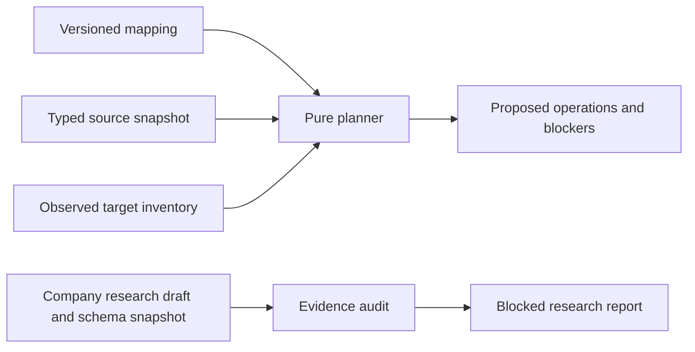

# Content import planning

Last review: 2026-09-14. Scope: M2-01 offline planning and company research audit. This subsystem does not write to WordPress or provide execution authority.

## Components and authority

[`packages/content-import`](../../packages/content-import/) contains the `stellar.content-import.v1` contracts, canonical serialization/digests and pure `compileDryRun` planner. It is separate from `packages/contracts`, which owns M1's editor/session/source protocol. The planner accepts already acquired JSON mapping, typed source snapshot and target inventory; it imports no provider SDK or application runtime and performs no filesystem/network I/O.

[`scripts/plan-content-import.mjs`](../../scripts/plan-content-import.mjs) is a small file-input boundary. It accepts exactly three named local inputs, bounds regular-file reads to 8 MiB each, converts invalid usage/JSON/contract failures into sanitized JSON, and prints the plan. It does not write reports itself. [`scripts/audit-company-content-map.mjs`](../../scripts/audit-company-content-map.mjs) is a separate evidence checker for the older company research format. That audit cannot be used as an executable mapping converter.

## Planning boundaries

The minimum normalized target schema declares post types, ACF groups and typed fields, and taxonomies. It validates binding compatibility instead of writing arbitrary object paths. Record identity is namespaced by source system, base, table and record. Media adds field and attachment identity plus content digest. Slugs, labels and temporary URLs never establish identity. Raw URL-bearing Airtable attachment responses are not this input format.

Complete view membership defines roots. Traversal follows only mapped forward relationships, required terms/ancestors and media. Explicit exclusions remain authoritative. Unmapped reverse links cannot broaden scope. Unsupported cycles and missing/cardinality-invalid dependencies produce blockers. Ordered relationships preserve order; unordered declarations and inventory collections are normalized for deterministic comparison.

Managed bindings contribute desired values; WP-owned bindings do not grant import permission. Matching target state is a noop. Updates carry observed target identity/revision, and collisions or incompatible ownership block intent. The future executor must independently enforce permission, identity uniqueness, freshness, operation replay and readback. An offline `approved_for_planning` record is evidence supplied by the caller, not an authenticated grant.

New posts have draft-only intent. A seed plan never publishes, deletes, unpublishes or cleans up source absence. Terms and media are not drafts; changed operations require explicit non-draftable policy for a disposable/staging target. ACF option writes have no implementation in this slice. Schema definitions are checked as prerequisites; the planner does not deploy them as part of a content operation.

## Company evidence

The research audit checks the existing 71 source bindings, IDs/labels/types, owner-table boundaries, view exclusions and declared seven-body/one-global section order against the committed 16-table/176-field schema snapshot. It is source-schema evidence only. There is no source record-value snapshot, real target inventory, approved ACF model or complete taxonomy/media mapping.

Every structurally valid legacy audit returns `blocked` and `LEGACY_DRAFT_NOT_EXECUTABLE`, even if someone inserts records or approval-shaped flags. Missing target field keys/schema, taxonomy, record values, media evidence, target inventory and global option policy are separately visible. The audit does not fetch Airtable, activate plugins, infer taxonomy from prose or approve anything.

## Limits and next integration

This first normalized contract handles a bounded field/relationship/taxonomy/media graph. It is not an arbitrary ACF flexible-content compiler, raw Airtable fetcher, media downloader, Markdown renderer/sanitizer, schema deployer, operation journal or concurrency lock. It has no WordPress writer, option writer, UI or release mechanism. File input limits bound the CLI, while callers of the package must also bound their input acquisition.

M2-02 owns actual company keys, composition, WP registration/ownership and SDL. M2-03 owns the independently runnable company importer/skill and durable execution/recovery. Settle distribution of the portable format or package explicitly; neither the company site's build nor public runtime may require the Stellar application. M2-04 owns the distinct GraphQL response fixture and typed page. See [M2 dispatch](../prds/m2.md) and [Decision 005](../decisions/005-content-plan-and-company-poc.md).

## Verification

Package tests cover planning semantics; process tests exercise CLI exits and input preservation; the company audit tests use the actual committed evidence plus corrupted variants. Root `lint`, `typecheck`, `test`, `verify` and `build` include the new package. The [operator guide](../user-guide/content-planning.md) describes the runnable commands. Session-specific results belong in the ExecPlan and review handoff.
