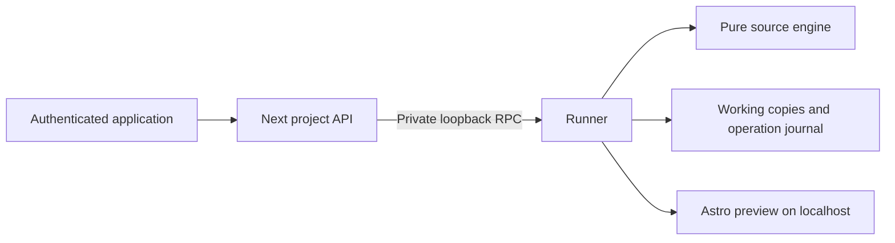

# Local project runner and source engine

M1-02 and its M1-03 dependency separate the Next application, trusted local process runner and pure source engine. This adapter accepts only two registered copies of the reviewed `astro-style-lab` fixture. It executes local project code with the developer's OS permissions; it is not a hostile-code sandbox or a hosted tenant boundary.

## Ownership and transport

The launcher starts the application on `http://127.0.0.1:3210` and runner on `http://127.0.0.1:4310`. The application brokers short authenticated calls; `apps/runner` owns working copies, Astro workers, source watching and durable writes. Preview URLs use `localhost` on separately assigned ports. This hostname split keeps the host-only application cookie out of preview requests.

A one-use nonce in the launcher's connection-link fragment establishes an eight-hour, signed HttpOnly, SameSite=Strict operator cookie. The connection page removes the fragment. Mutations require an exact application Origin and a CSRF token. All project reads also require the operator. The server-only broker supplies its private bearer secret and operator identity to the loopback runner. Arbitrary project paths, commands and dependency URLs are not public request parameters. Launcher secrets rotate; the operator ID persists so a newly connected operator can reconcile their earlier project requests.

The shared request and response definitions remain in `packages/contracts`; [editor contracts](editor-contracts.md) describe their identity and revision semantics. The project route prefix is `/api/projects/{projectId}/sessions/{sessionId}`. It exposes session reads/close/restart, pages, source model, prepare/apply, request-outcome lookup and read-only history. Request IDs identify logical operations; retries reuse an ID only with identical intent. A restart can return a new session ID; callers must use the returned session and preview generation. NextURL normalizes loopback IPs internally, so URL validation allows its `localhost` representation at the same protocol/port; actual incoming Host and browser Origin checks remain exact.

## Source and process boundaries

The fixed registry maps opaque IDs to independent `.stellar-local/copies` roots; `.stellar-local/metadata` holds revision ledgers and operations. Source is copied from the seed without its generated build output. Installed, pinned fixture dependencies are shared by a controlled dependency link. Opening never installs packages. Executable configuration must still match the reviewed fixture before a preview starts.

Each Astro worker receives a small environment rather than application/provider credentials. Its development server binds loopback with strict port and filesystem-serving restrictions. Readiness waits for the owned worker to listen and for both fixture routes to respond. Closing stops its watcher and process group while retaining source and receipts. Startup failures return fixed actionable messages, not raw logs or host paths.

Source snapshots cover the fixture manifest and relevant source bytes. A byte change rotates the opaque persisted revision; a no-op parse or ordinary restart preserves it. Preview generations rotate independently. M1 fixes the manifest's semantics to the reviewed fixture: changing its capabilities is not a way to authorize a new source path. All read/write paths reject traversal and symlinks escaping the registered root.

## Proposals and durable writes

`packages/editor-core` uses Astro's parser and PostCSS to identify authored targets. It accepts bytes, a validated fixture manifest and revision; it performs no filesystem or process operations. `createSourceModel`, `resolveSourceSelection` and `prepareSourceChange` expose the model/selection/prepare seam. The target ID doubles as the revision-scoped preview source key. The future bridge must also validate frame, generation and runtime occurrence.

Supported commands are local `style.set`, `style.reset` and concrete-leaf `token.set`. Each proposal modifies one declaration span in one allowlisted CSS file. Alias definitions, repeated component internals, ambiguous ownership, malformed source and unsupported values remain read-only. The engine recomputes ownership before preparing and validates the resulting declaration. Token impact describes only the manifest's fixture coverage. No Stacki code is incorporated.

`applySourcePatch` checks the exact preimage and full-file digest in memory. `createInversePatch` additionally proves that reversing the supplied postimage reconstructs the original full-file digest. These helpers do not grant write authority: the runner resolves its stored proposal and revalidates operator, session, revision, target and current bytes inside the project's serialized operation.

The runner syncs an intent containing preimage, postimage, patch, request identity and preallocated receipt before replacing one source file. It then syncs the revision ledger and completed operation. Retries return that durable result. Recovery compares the actual file to the recorded before/after bytes: before is unapplied, after recovers the receipt, and a third state conflicts. New work must reconcile outstanding intents first. M1-06 will use this journal for guarded undo/redo; history currently has no mutation controls or automatic pruning.

Ordinary filesystem replacement cannot provide a transaction with an arbitrary external editor. The runner detects observed revisions and rechecks bytes immediately before replacement, but an uncooperative write in that final check/rename window remains a limitation. Supported concurrent writes go through one runner owning the data directory. Keep working copies and journals when stopping or reverting the application.

## Verification and next seam

`npm run verify` includes real Astro and source-engine runner tests. `npm run build` builds the application, packages and standalone seed. After building, `npm run verify:local` starts temporary production application/runner processes and exercises the authenticated API against two real Astro copies, applies an engine patch, checks isolation/idempotency/staleness and reopens the persisted result after a runner restart. These temporary acceptance copies are separate from the developer's `.stellar-local` state.

M1-04 owns the project/canvas shell and development-only Astro instrumentation, supplied through the runner's programmatic Astro launch seam without rewriting ordinary project configuration. M1-05 owns inspector interaction. M1-06 owns guarded history mutations and the complete visual editor proof. See the [local setup guide](../user-guide/local-projects.md).
