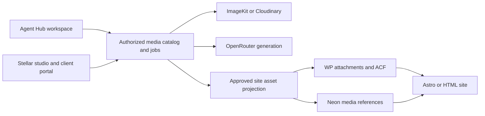

# Shared foundation, media library, and integrations

2026-09-14 · Proposed architecture refinement for PRD v0.5. The user subsequently confirmed personal-GitHub development, intended company licensing, Pennsylvania/USA employee status and authorization for initial commits, folder reordering and harness inclusion. Actual reuse rights and a company agreement remain unresolved. Product packaging, vendor terms and account boundaries are not yet approved. This research does not change the company-site import; the [bootstrap plan](../BOOTSTRAP-PLAN.md) records subsequent repository work.

## Recommendation

Reuse Agent Hub's working foundations through explicit modules, while keeping Stellar a separately usable product. A Websites entry in Agent Hub can open Stellar with the current authorized client/project context. Stellar-only customers should enter a focused studio directly, without buying Agent Hub or seeing its chat/social workspace. Sharing implementation does not require copying the entire application or sharing every database table.

Because personal ownership and separate development spending are stated requirements, the default implementation proposal is a Stellar-owned application/backend with selected reusable packages and explicit account configuration. If the user owns both products under the intended owner, a shared monorepo and common platform deployment may be simpler. Resolve that ownership boundary before importing proprietary Agent Hub code. No ownership conclusion follows from a private GitHub repository or who paid for a model call.

| Approach | Benefit | Cost / fit |
| --- | --- | --- |
| Websites directly inside the current Agent Hub app | Fastest access to its existing login, client context and shell. | Inherits its data model, account assumptions and release coupling. Appropriate for an internal pilot if ownership is aligned; standalone operation needs an explicit product boundary. |
| Clone Agent Hub and remove features | Provides working examples immediately. | Carries unfinished features and agency-specific defaults; later fixes diverge between copies. Avoid as the long-term architecture. |
| Shared modules, separate Stellar entry/application | Reuses mature code while preserving focused UX, independent deployment and account ownership. | Requires selective extraction and adapter work. Recommended default given the ownership requirement. |
| Rebuild all foundations | Maximum freedom. | Repeats substantial working auth, agent and skill infrastructure. Not justified by the current evidence. |

Start with a modular application, not a new fleet of microservices. Packages are code boundaries; a deployment boundary is added only when isolation, runtime needs or ownership warrants it. Keep the website editor/build runner separate from ordinary web requests as already specified.

The proposed workspace toggle becomes a product/area switcher for users entitled to both products. Switching areas preserves an authorized client/project selection and unsaved-work state. Client editors enter their site portal directly. Product entitlement controls access as well as navigation; hiding Agent Hub menus alone is insufficient separation.

## What Agent Hub can actually contribute

Read-only inspection of `../agent-hub` found an active, dirty checkout on `feat/brief-form-sectioned-rail`, ahead of its remote by three commits. These are checkout observations, not production verification. The package is private; no top-level license was found and some bundled skills declare proprietary licensing. No files were changed there.

| Area | Verified state | Reuse boundary |
| --- | --- | --- |
| Authentication and tenancy | AuthKit/session handling, user/organization mirroring and tenant authorization exist. | Reuse behavior/tests; Convex helpers depend on Agent Hub's generated schema and need adaptation. Tenant checks (`agent-hub/convex/lib/authz.ts:67`) |
| Letta chat and roles | Streaming chat, run ledger and six role templates (general plus five specialists) exist. The adapter assumes one Letta organization and application-managed tenant/environment tags. | Parameterize account/provider/persona configuration and enforce scope in the broker. Tags are not vendor-enforced tenant isolation. Adapter (`agent-hub/src/lib/agents/letta.ts:1`) |
| Skills and workflows | Parsing, archives, import/export, visibility rules, draft creation and runnable workflow templates exist. | Extract the pure types/parser/archive helpers first, then share definition and capability contracts. Archive helpers (`agent-hub/src/lib/skills/archive.ts:1`), run preparation (`agent-hub/convex/workflowTemplates.ts:1576`) |
| Connections | Several connectors store organization-scoped secrets via WorkOS Vault. Some source defaults and sync behavior are agency-specific. | Reuse the connection lifecycle and client-injected Vault wrapper; remove application-specific names and source IDs. Vault adapter (`agent-hub/src/lib/integrations/workos/vault.ts:139`) |
| Scheduling, artifacts, costs | Scheduling currently implements the Social workflow; general artifact export remains a draft; billing/usage pages are placeholders. | These remain implementation work, regardless of product packaging. Scheduler (`agent-hub/convex/scheduledWorkflows.ts:59`), artifact PRD (`agent-hub/docs/prds/workbench-06-artifacts-export.md:1`), billing (`agent-hub/src/app/(dashboard)/settings/billing/page.tsx:1`) |
| Media models and Pipes | Image/video entries exist in the model catalog but are excluded from text-chat provisioning. No media generation route or Pipes runtime integration was found. AI provider credential routes are stubs. | Add a separate generation service and Pipes adapter; do not count catalog entries or schemas as completed capability. Model access (`agent-hub/src/lib/ai/model-access.ts:139`), provider route (`agent-hub/src/app/api/v1/settings/ai/providers/route.ts:12`) |

Prioritize contracts for identity/scope, skills/workflow definitions, tool execution, connections, artifacts/media and usage. Avoid sharing Agent Hub's whole Convex schema. A combined deployment may map both products to a common platform identity; separate deployments need explicit identity mapping and authorized exports, not copied credentials or raw client transcripts.

## A shared agency media capability

The media library belongs to the reusable platform capability, rather than exclusively to Agent Hub chat or a single website. It may be implemented first in Stellar. Agent Hub can later use the same module or an authorized connector. A standalone Stellar deployment must be able to instantiate it with its own account and records.

Convex can store logical asset metadata, permissions, approvals and jobs; the DAM stores originals, versions and derivatives. For each asset, retain a stable logical ID, provider/account/asset IDs, revision/hash, client owner, source or generation provenance, rights/expiry, approval state and access grants. Keep each placement's site, page/field, alt text, caption and crop in an `AssetUse` record: the same photo can need different alternative text and crops in different contexts.

An agency-level library view aggregates only assets the actor may access. Client and site libraries are approved subsets, not copies of every agency asset. Validate selection and delivery server-side. A vendor widget opened to a folder is a UI filter, not an authorization boundary. For stronger isolation use separate client vendor accounts/subaccounts/product environments; do not expose an agency-wide administrative key. Draft/restricted files also need private delivery controls, since DAM browsing permissions do not make a public CDN URL private. [ImageKit sharing](https://imagekit.io/docs/dam/sharing-and-collaboration), [Cloudinary delivery access](https://cloudinary.com/documentation/control_access_to_media)

Pin the asset revision used by a release. Replacing a shared original should show affected uses and require the appropriate release/update policy. Record missing/deleted assets, prevent accidental removal of in-use originals, and export authorized originals plus metadata during offboarding. `.stellar` packages carry asset references, hashes, provenance and authorized bundled files, never provider secrets.

## ImageKit versus Cloudinary

| Concern | ImageKit | Cloudinary |
| --- | --- | --- |
| Embedded DAM | Widget supports search, selection, collections and inline/modal display; vendor login/SSO applies. | Embedded Media Library supports selection and configuration; vendor access/plan constraints apply. |
| Website delivery | Image/video transformation and CDN capabilities; official WordPress integration. | Transformation/CDN capabilities; official WordPress integration and DAM selection. |
| Client account separation | Documented independent libraries/keys through enterprise or partner subaccounts, with parent/client billing options. | Product environments and access roles; confirm the required client/account arrangement and plan. |
| Fully branded client experience | A custom picker over provider APIs gives more UX control; enterprise authentication and commercial permissions need checking. | The same distinction applies: widget styling options do not establish resale or branding rights. |

Sources: [ImageKit widget](https://imagekit.io/docs/dam/embeddable-media-library-widget), [Cloudinary widget](https://cloudinary.com/documentation/media_library_widget), [ImageKit subaccounts](https://imagekit.io/docs/sub-accounts), [Cloudinary administration](https://cloudinary.com/documentation/dam_admin_permissions), [ImageKit WordPress](https://imagekit.io/docs/integration/wordpress), [Cloudinary WordPress](https://cloudinary.com/documentation/wordpress_integration).

**Pilot ImageKit first**, conditional on acceptable partner/enterprise terms and cost. Its documented subaccount model matches the agency/client arrangement. Keep Cloudinary as the comparison if its media/rights workflows or an existing agreement are advantageous. No price or total-cost winner is established: compare seats, subaccounts, storage, bandwidth, transformations, generation and export costs using the actual pilot workload.

“Embeddable” and “white-label resale” are different claims. Cloudinary's published MSA restricts making the service available to third parties and removing its branding; an applicable negotiated agreement may differ. ImageKit's terms recognize end users and authorized resellers, but that is not blanket permission for any OEM offering. Confirm the intended embedded client portal, branding, account ownership and resale rights in the applicable vendor agreement before commercialization. [Cloudinary MSA, sections 1 and 4](https://cloudinary.com/msa), [ImageKit terms](https://imagekit.io/terms). This review does not determine the terms of any existing agency contract.

For the company POC, preserve the portable import: Airtable attachments become durable WP attachments, with stable source IDs. Add the DAM as an optional asset source after that path works. Selecting an approved DAM revision should create or reuse the appropriate WordPress attachment, then populate ACF image/file/gallery fields with valid WP identities. A raw external URL is not automatically an ACF attachment. Verify draft/published WPGraphQL output, alt text, sizes and responsive Astro rendering; PHP HTML-rewriting behavior in a WP plugin does not prove equivalent headless behavior. Avoid applying redundant optimization in Astro and the DAM.

For Neon, store the logical asset/version reference and required delivery metadata through the CMS adapter. Published sites must resolve their approved assets without querying Agent Hub or Stellar on each public request. Their declared DAM/CDN can remain a serving dependency. A local-original or export fallback is a separate supported mode with its own storage cost.

## Letta and media generation

Make image generation an explicit Stellar capability. The agent requests a typed tool such as `media.generate`; an application-owned worker authorizes the client/site, selects an allowed image-capable OpenRouter model, checks the budget, calls the provider and imports the output into the asset library. Letta's reasoning model remains separate from the model performing image generation. Current OpenRouter documentation includes a dedicated image API, and Letta supports client/MCP tools. [OpenRouter image generation](https://openrouter.ai/docs/guides/overview/multimodal/image-generation), [Letta tools](https://docs.letta.com/agent-sdk/mcp)

Return asset IDs and small previews to the agent, not large base64 images or API keys. Persist the job, prompt/reference provenance, model/provider, requesting actor, usage/cost, result revision and approval state. An interrupted paid request must be reconciled before a retry; an idempotency key in Stellar does not prove provider-side deduplication. Generated content starts as a draft asset and passes the same rights, brand and publication controls as uploaded content. Add image editing and other modalities according to separately verified model capabilities.

Use the chosen Stellar billing connection explicitly. Distinguish development costs used to build Stellar from runtime costs incurred by its users. Agent Hub's current provider names and credential stubs are not a BYOK or billing implementation to copy unchanged.

## WorkOS Pipes is now identified

Use WorkOS Pipes for supported connected-account authentication: OAuth lifecycle and stored API-key credentials, including custom providers. It complements the existing WorkOS Vault approach; it does not require migrating every existing secret or connector immediately. Provider authentication must fit Pipes' supported method. APIs requiring compound signing credentials or custom request signatures may still need an adapter and secret storage. [Pipes overview](https://workos.com/docs/pipes), [custom providers](https://workos.com/docs/pipes/custom-providers)

Organization-scoped configuration can vary provider credentials, scopes and enablement. It does not by itself define which employees, agents or sites may use a connection. Enforce the actor's membership, client/site grant and allowed action in the application. Do not assume a user's connection automatically becomes an agency-wide service account. [Organization-scoped providers](https://workos.com/docs/pipes/organization-scoped-providers)

Pipes supplies credentials/connectivity; provider adapters supply API operations; MCP can expose typed agent tools; Stellar's durable jobs implement mapping, sync, deduplication, conflict handling and audit. A connected ClickUp account does not create bidirectional Kanban synchronization by itself.

WorkOS also documents Relay, currently early access, which forwards requests without exposing provider credentials. Its documented authentication still uses a WorkOS environment API key. Keep that key in a trusted broker rather than giving it to project code or agents; the broker applies per-run authorization. Relay is an optional proof, not a launch dependency or a complete sandbox security boundary. [Relay](https://workos.com/docs/pipes/relay)

## Custom loaders can support an editable Stellar experience

Stacki's restriction is replaceable. Its current introspection recognizes only built-in `glob()` and `file()` collections as editable; its CMS returns no entries for other loaders and its writer patches local files. That describes the existing adapter, not Astro's capabilities. [Introspection](https://github.com/flowtricks/stacki/blob/800fa5270523e7df3afbcaeee8bdbb3a6fe07b49/electron/content/introspect.mjs#L35), [entry listing](https://github.com/flowtricks/stacki/blob/800fa5270523e7df3afbcaeee8bdbb3a6fe07b49/electron/contentEntries.js#L109), [writer](https://github.com/flowtricks/stacki/blob/800fa5270523e7df3afbcaeee8bdbb3a6fe07b49/electron/main.js#L2534)

A custom Astro loader reads a source into Astro's collection store. Updating that store alone does not update the source; loaders may reconcile incrementally or replace cached data. Add a source adapter for schema/list/read/create/update, relation/media handling, revisions and permissions. A GUI or agent edit follows: validate ownership and base revision → guarded source write → readback → refresh preview/rebuild. Do not turn the desktop file-path writer directly into a remote HTTP endpoint. [Astro loader API](https://docs.astro.build/en/reference/content-loader-reference/)

The POC remains external Airtable → WP/ACF → WPGraphQL → Astro. It does not need an Airtable-to-Astro loader. Imported Airtable-owned fields remain protected under the selected ownership policy; ordinary WP-owned fields may be edited through a scoped WP adapter. Neon and Convex can implement their own source adapters. This is a product permission decision, independent of whether the read source uses an Astro loader.

## Ownership and the next bounded proof

The user wants control of Stellar's product IP and spending. Record the intended owner of original code, repository, service accounts, OAuth applications and development/runtime billing. Confirm rights to reuse Agent Hub's proprietary material. Paying for generation alone does not resolve employment, assignment or contributor rights; those depend on the relevant agreements and law. [US Copyright Office ownership guidance](https://www.copyright.gov/title17/92chap2.html)

Stacki's local source is MIT-licensed, with its existing copyright notice. Original Stellar code can have its own licensing while retained third-party portions keep their required notices; do not relabel the entire fork as exclusively original Stellar IP. Check Lumos, dependencies, fonts, templates and assets separately. [Stacki license](https://github.com/flowtricks/stacki/blob/800fa5270523e7df3afbcaeee8bdbb3a6fe07b49/LICENSE#L1)

Next proof, after the ownership/product boundary is selected: reuse the smallest verified auth/Letta/skill slice; present a focused Stellar page; select one approved library asset and one generated draft; map the approved asset into a WP attachment/ACF field; render it in the existing Astro staging path; verify another client cannot browse/select it and another page stays draft. Prove export of its original, metadata and use references. Keep the existing standalone Airtable seed intact. No vendor signup, paid generation, code migration, import or deployment occurred during this research.
