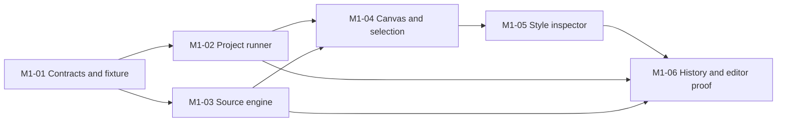

# Initial editor milestone: M1

The next wave is [M2 — Company WordPress proof](m2.md), starting with offline mapping validation and dry-run planning. This page preserves the completed M1 scope and evidence.

Status: M1-01 through M1-06 are implemented and reviewed locally. The integrated browser proof passed on 2026-09-14; see the [review and evidence](../handoffs/m1-editor-review.md). User visual review is ready. These are local identifiers; ClickUp and Macroscope remain unconfigured.

M1 proves this workflow: open a registered project, view a real Astro page, switch viewport width, select an element, inspect its style source, apply a supported local style or shared-token change, undo/redo, then close and reopen without losing the change. The code on disk is authoritative. A CSS change that exists only in an iframe or browser storage does not pass.

## Scope and relationship to the product PRD

M1 is the local editor proof described in [bootstrap slices 2–3](../BOOTSTRAP-PLAN.md). It precedes integration with the larger **Milestone A** in the [product PRD](../STELLAR-PRD.md). It does not replace the confirmed company-site POC or claim to finish product requirements R01/R04/R06/R07/R08 in full.

The first executable project is a small, versioned Astro fixture with its own editable token manifest, two pages and representative component cases. Opening a project means selecting an already registered working copy from the local project list. Two separate copies exercise project boundaries and persistence. GitHub OAuth, arbitrary repository import, OS folder picking in the browser and editing the company's original checkout are outside M1.

The first runner is explicitly for a trusted local developer fixture. It is a replaceable adapter, with constrained project access and a separate preview origin. It is not an untrusted-code sandbox or a hosted multi-tenant service. WorkOS, Convex, Letta, cloud workspace providers and Agent Hub are not prerequisites for this proof. The chosen product stack remains the direction for subsequent hosted work.

## PRD set and dispatch order

| Local PRD | Deliverable | Required predecessors | Main ownership |
| --- | --- | --- | --- |
| [M1-01 — Contracts and fixture](m1-01-contracts-and-fixture.md) | Shared protocol, supported edit matrix and reproducible Astro fixture | Completed bootstrap | `packages/contracts`, `fixtures/astro-style-lab`, root workspace wiring |
| [M1-02 — Project runner](m1-02-project-runner.md) | Registered working copies, session lifecycle, real preview and guarded source persistence | M1-01 | `apps/runner`, server project/runner adapters and API transport |
| [M1-03 — Source engine](m1-03-source-engine.md) | Source model, exact declaration targets, minimal patch proposals and inverse edits | M1-01 | `packages/editor-core` |
| [M1-04 — Canvas and selection](m1-04-canvas-and-selection.md) | Project opening, page/viewport shell, browser instrumentation and source-linked selection | M1-02 and M1-03 | Studio routes/components, preview bridge, `packages/astro-editor-integration` |
| [M1-05 — Style inspector](m1-05-style-inspector.md) | Contextual controls, local overrides/reset, token impact review and apply feedback | M1-03 and M1-04 | Inspector and edit-client UI; integration through the runner |
| [M1-06 — History and editor proof](m1-06-history-and-editor-proof.md) | Durable undo/redo, restart/conflict recovery and integrated milestone evidence | M1-02 through M1-05 | History additions and end-to-end proof |

M1-02 and M1-03 can run in parallel after M1-01 is integrated. M1-04 may sketch UI against frozen contracts earlier, but cannot pass until it selects real rendered elements. M1-05 may build isolated controls early; its completion requires real source writes. M1-06 can plan fixtures early; it closes the integrated milestone. Mock-only results are not completion evidence.

## Shared decisions for all agents

- [M1-01](m1-01-contracts-and-fixture.md) owns shared names, request shapes, fixture semantics and error codes. Consumers import the contract; they do not invent parallel copies. A contract change is integrated before dependent work continues.
- The source engine proposes deterministic changes; the runner is the only writer. Both future agents and the GUI will use these same commands. Installing a runtime agent is deferred.
- Source edits are limited to one file per command: an explicit local CSS declaration, removal of its override, or an allowlisted base token definition. AST-wide serialization, arbitrary CSS, prop edits, structural dragging and code-editor writes are later capabilities.
- Local style scope is either base or the fixture's one declared mobile media condition. Changing the canvas width does not implicitly choose a write scope. Shared token edits are base-only in M1.
- Element and token-definition targets are distinct. The inspector follows an explicit manifest mapping to an approved concrete base token; semantic aliases remain intact. Reset removes only an owned override above a separate authored fallback.
- A shared component's internal element is not automatically an editable instance. Ambiguous, generated, inherited or unsupported targets remain inspectable with a clear read-only reason.
- App UI tokens in `apps/web/app/globals.css` are separate from website tokens in the project. Do not use site changes to modify the Stellar shell.
- Main is the integration branch. Use separate worktrees for concurrent agents and SOL with high reasoning. The active task's authorization governs commits, pushes, PRs and merges; these PRDs do not grant blanket publication authority.

## Delegation and completion contract

Assign one PRD per implementation task. Its handoff lists owned files, exclusions and prerequisites. Agents first read `harness.json`'s intake set and the actual predecessor outputs, then create their own implementation ExecPlan where required. Each task reports implemented acceptance IDs, tests actually run, remaining limitations, relevant source revision and a reviewable diff. Cross-owner edits go through the coordinating task; do not have two agents independently change the root lockfile, contracts or shell state.

For each code task, run the applicable root verification groups and production build for user-visible work. Add meaningful tests to the root commands and CI as features arrive; the existing four harness tests cannot validate an editor. Each agent updates architecture documentation and sweeps user guides. M1-04 onward includes browser screenshots at desktop and mobile widths. M1-06 adds a short video of the complete edit/reopen workflow and source diffs, in the evidence directory or a referenced review artifact. Evidence must identify the tested revision and viewport. A reviewer agent does not satisfy a requested user design review.

Use this dispatch structure, substituting the selected PRD path and a real task scope: read the harness intake and M1 index; implement only that PRD after confirming its prerequisites; follow its ownership boundaries and acceptance criteria; record verification and evidence; leave a handoff stating what the next agent can rely on. Do not launch all six as independent tasks at once.

## Milestone exit checklist

- [x] Both registered fixture copies open; edits in one never affect the other or the fixture seed.
- [x] Home and Contact render through Astro at 390, 768 and 1440 CSS pixels, plus an intermediate width; one frame is actively editable.
- [x] Clicking a supported element selects the correct source-backed target and exposes provenance and scope.
- [x] A local override, reset and shared-token change alter source and the rendered page with the expected scope; shared impact is reviewed.
- [x] Browser reload, preview restart and workspace reopen retain applied source. Lost responses and duplicate requests do not repeat an edit.
- [x] Undo/redo works; a stale edit or stale undo cannot overwrite an observed newer source revision.
- [x] Unsupported or ambiguous source stays intact; invalid messages, targets and project/session combinations cannot trigger a write.
- [x] The edited fixture builds and serves outside Stellar without editor markers, bridge code or a Stellar runtime dependency.
- [x] Evidence and source-preservation tests pass. Known limits are recorded and the user can review the workflow.

## Follow-on work kept explicit

After M1, connect the existing [company WP/ACF POC](../POC-01-company-site.md), which seeds WordPress from Airtable outside Stellar. Plan hosted identity/storage and an isolated remote runner, general repo onboarding, Lumos adapter validation, genuine HTML authoring, full page/block composition, code editing, client permissions and agent execution as subsequent slices. None is fulfilled merely by this fixture proof.

## Independent platform

- [E01 identity and named projects](e01-platform-foundation.md) — standalone WorkOS/Convex first slice, independent of company M2.
- [Letta same-command proposal proof](e01-letta-command-proof.md) — draft gated on foundation acceptance and runner connectivity.
- [OpenRouter draft generation](e13-openrouter-draft-generation.md) — draft with budget, provenance and reconciliation controls; no paid execution.
