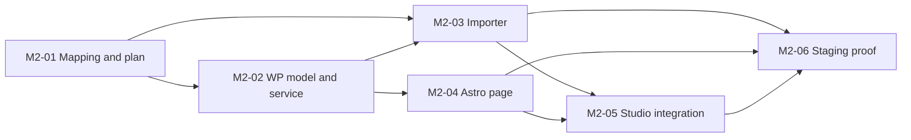

# Company WordPress proof: M2

Status: **M2-01 implemented and reviewed locally; M2-02 through M2-06 proposed**. See [M2-01 results](../handoffs/m2-01-review.md). M1 remains the completed trusted-local editor proof. M2 moves into the existing [company-site POC](../POC-01-company-site.md), contributing to the parent PRD's Milestone A without claiming the full product. These are local PRD identifiers; tracker/review/deployment services remain unconfigured.

The milestone is a real, thin path: review a mapping, seed WordPress drafts independently, render one typed Astro page, open that page in Studio, edit supported source and WP-owned draft content, then verify a selected staging release while another page stays draft. Astro reads WPGraphQL. Airtable and Stellar are unnecessary for serving the seeded site.

## Dispatch and ownership

| PRD | Deliverable | Acceptance predecessors | Implementation owner |
| --- | --- | --- | --- |
| [M2-01 — Mapping and dry run](m2-01-content-mapping-and-dry-run.md) | Portable strict contracts, pure offline planner, synthetic fixture and blocked company evidence audit | Completed M1; research artifacts | Stellar `packages/content-import`, audit/CLI scripts and root coordinator |
| [M2-02 — WP model and ownership](m2-02-wordpress-model-and-ownership.md) | Approved ACF definitions, shared guarded write service and committed SDL | M2-01; concrete schema review and verified plugin/runtime inputs | Company `altitude-headless-theme` |
| [M2-03 — Independent seed executor](m2-03-independent-seed-executor.md) | External importer/skill, durable identity/media and resumable draft writes | M2-01 and M2-02 real service | Company `altitude-headless-theme` |
| [M2-04 — Typed Astro page](m2-04-typed-astro-page.md) | Representative blocks, typed WPGraphQL read, public/draft boundaries | M2-02 SDL; M2-03 for real readback | Company `altitude-astro` |
| [M2-05 — Company page in Studio](m2-05-company-project-studio.md) | Real project adapter, source controls, ownership-aware WP draft edits | M2-02 through M2-04 | Stellar adapter/UI; service changes stay with WP owner |
| [M2-06 — Staging release proof](m2-06-staging-release-proof.md) | Selected-page release manifest, independent frontend and failure/recovery evidence | M2-03 through M2-05, concrete live authorization | Coordinator across existing company pipelines |

After M2-01 contract freeze, M2-02 service implementation and M2-03 pure executor logic can proceed in disjoint files; real importer acceptance waits for the service. M2-04 owns its proposed GraphQL response/view-model fixture, coordinated with M2-02, and can prepare offline components concurrently. That fixture is distinct from M2-01's import inputs; codegen acceptance requires real committed SDL and full readback requires seeded WP. M2-05 connection states can be designed early; working connection and content edits cannot be declared from mock endpoints. M2-06 prepares its checklist early and runs after live dependencies are ready.

## Contract and review rules

- Read harness intake, this index, the assigned PRD and actual predecessor outputs. Use SOL high for every explicitly delegated implementation/review agent. Give root wiring/contracts one owner and parallel agents disjoint files or worktrees.
- Source snapshots are observations. Draft mapping, validated source IDs, approved target schema, applied schema, seeded records and published content are separate states. A successful plan is neither proof of a write nor permission to execute one.
- Schema deployment and content writes are distinct. Review actual proposed definitions before asking for schema approval. Stable source identities and per-field/relationship/taxonomy ownership survive import; slugs never provide upsert identity.
- The canonical company importer/skill and ownership service belong in the WP repository. M2-01's portable format/planner does not introduce a Stellar application dependency. Determine distribution and rights explicitly at integration; do not copy Agent Hub or company implementations into Stellar.
- Preserve the runner-only source writer and observational preview boundary. WP content commands use the server content service and never give the frame credentials. Existing M1 style/history rules remain intact.
- Terms, attachments and options do not acquire a draft state merely because related posts are draft. Side effects need explicit environment policy and review. M2-01 excludes option writes; later PRDs must handle them deliberately.
- User review and publisher authorization are separate from agent review. Existing instructions authorize local implementation/commits, not live writes, pushes, merges or deployments in this task.
- Add app navigation only for working capabilities. Keep busy CMS mockups as inspiration; expose contextual readiness, ownership, review and recovery where they help an actual action.

## Current evidence and open inputs

Read-only local inspection on 2026-09-14 found clean company checkouts at their recorded baselines: Astro `0a956281`, WP `80cf5252`. The WP tracked tree still contains scaffold placeholders rather than the content plugin/ACF model; Astro has its placeholder page and no real GraphQL content route. This inspection did not fetch remotes or inspect live staging. These findings are documented with the [M2 decision](../decisions/005-content-plan-and-company-poc.md).

Nothing blocks M2-01 offline planning. Later gates are concrete schema/field-key/shared-entity approval, taxonomy definitions and source assignments, ACF license/plugin availability, verified runtime and Local JSON paths, a distinct WP-owned editable draft, real content/media snapshots, final component/token source and current staging capabilities. Missing copy/links/navigation and design parity block release, not honest draft diagnostics. No Agent Hub access is needed now.

## Acceptance and handoff

Every task reports its acceptance IDs, touched repos/files, actual verification, tested source revision, known limits and next dependency. UI work includes desktop/mobile browser evidence and readback/source/reopen proof. Executor work includes replay and failure receipts; release work includes current staging evidence and recovery, not historical task labels. Keep current-work, plans, architecture and operations log aligned.

M2 does not silently absorb genuine HTML authoring, Lumos generalization, Neon/Vercel, hosted WorkOS/Convex accounts, Letta runtime, client DAM, arbitrary structural authoring or the complete agency portal. Those remain explicit subsequent product proofs.
